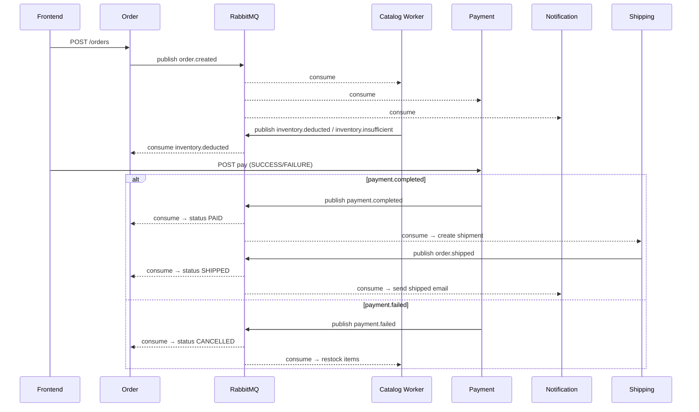

# Architecture Review — Current State

**Last Update**: 2026-06-22

---

## Maturity Scores

| Service | Score | Pattern |
|---------|-------|---------|
| Order (NestJS) | 9/10 | Strict Hexagonal |
| Review (NestJS) | 9/10 | Strict Hexagonal |
| Catalog (Laravel) | 8.5/10 | Pragmatic DDD |
| Notification (Node) | 7.5/10 | Hexagonal |
| Identity (Node) | 7/10 | Hexagonal |
| Payment (Node) | 7/10 | Hexagonal |
| Shipping (Node) | 7/10 | Hexagonal |

---

## Services Detail

### Order Service (NestJS) — 9/10
- **Domain**: `order.entity.ts` — pure aggregate, no framework imports, no crypto
- **Ports**: `IOrderRepository`, `IMessagePublisher`
- **Adapters**: TypeORM repository, RabbitMQ publisher + consumer (handles `inventory.deducted`, `inventory.insufficient`, `payment.completed`, `payment.failed`, `order.shipped`)
- **Anti-corruption**: `OrderMapper` ORM ↔ domain
- **Status**: `PENDING` → `PAID` → `SHIPPED` transitions driven by events
- **Gap**: `FindOrdersByCustomerUseCase` should return typed DTO

### Review Service (NestJS) — 9/10
- Copied Order Service pattern exactly
- **Domain**: `Review.entity.ts` — id, productId, customerId, rating, text
- **Ports**: `IReviewRepository`
- **Adapters**: TypeORM repository, JWT auth guard on delete
- **API**: `POST /reviews`, `GET /products/:id/reviews`, `DELETE /reviews/:id`
- **Auth**: Admin deletes any review; user deletes only own

### Catalog Service (Laravel) — 8.5/10
- **Domain**: `Product.php` — `reduceStock()`, `setStock()`, domain exceptions
- **Use cases**: `CreateProductAction`, `DeductStockUseCase`, `UpdateStockUseCase`, `RestockProductUseCase`
- **Events**: Consumes `order.created` + `payment.failed`, publishes `inventory.deducted` + `inventory.insufficient`
- **API**: `GET/POST /api/products`, `GET /api/products/{id}`, `PATCH /api/products/{id}/stock`, `DELETE /api/products/{id}`
- **Gap**: No explicit DTOs for request validation; generic `\Exception` used in some use cases instead of domain exceptions

### Identity Service (Node) — 7/10
- Refactored from 86-line Express blob to hexagonal (2026-06-22)
- **Domain**: `User.entity.js` (id, email, password, role, isAdmin())
- **Use cases**: `RegisterUseCase` (bcrypt + duplicate check), `LoginUseCase` (bcrypt compare + JWT sign)
- **Adapters**: `PgUserRepository`, `JwtProvider`
- **API**: `POST /register`, `POST /login` (unchanged)
- **Gap**: No formal port interface JS classes (JSDoc only)

### Payment Service (Node) — 7/10
- Refactored from in-memory `Map` to persisted PostgreSQL (2026-06-22)
- **Domain**: `Payment.entity.js` (id, orderId, status, transactionId, amount, items)
- **Use case**: `ProcessPaymentUseCase` — validates PENDING status, prevents double-processing, publishes `payment.completed`/`payment.failed`
- **Adapters**: `PgPaymentRepository` (UPSERT, JSONB items), RabbitMQ consumer (listens `order.created`), publisher
- **Queue**: `payment_service_orders` durable, named — no event loss on restart
- **Gap**: No port interface JS classes

### Shipping Service (Node) — 7/10
- New service (2026-06-22)
- **Domain**: `Shipment.entity.js` (id, orderId, trackingNumber, carrier, status)
- **Use case**: `CreateShipmentUseCase` — on `payment.completed`, generates FedEx tracking, saves, publishes `order.shipped`
- **Adapters**: `PgShipmentRepository`, RabbitMQ consumer + publisher
- **API**: `GET /shipments/:orderId`
- **Gap**: No port interface JS classes

### Notification Service (Node) — 7.5/10
- **Domain**: `EmailTemplate.js` — `formatOrderConfirmation()`, `formatOrderShipped()`
- **Use cases**: `SendOrderEmailUseCase` (for `order.created`), `SendShippedEmailUseCase` (for `order.shipped`)
- **Adapters**: RabbitMQ consumer (dispatches by routing key), CatalogClient (HTTP), MailProvider (Nodemailer)
- **Queue**: `notification_emails` durable, bound to `order.created` + `order.shipped`
- **Gap**: No formal port interface classes; `CatalogClient` hardcoded in composition root; always `ack()` on error (no DLQ)

---

## Saga Flow (Current)

---

## Docker Compose

| Service | DB Container | Port |
|---------|-------------|------|
| order-service | order-db (postgres:15) | 3001 |
| catalog-service | catalog-db (mysql:8) | 8000 |
| catalog-worker | — | — |
| identity-service | identity-db (postgres:15) | 3002 |
| payment-service | payment-db (postgres:15) | 3003 |
| review-service | review-db (postgres:15) | 4000 |
| shipping-service | shipping-db (postgres:15) | 4001 |
| notification-service | — | — |
| frontend | — | 3000 |
| rabbitmq | — | 5672, 15672 |
| mailhog | — | 1025, 8025 |

---

## Remaining Improvements

### Quick Wins
- Formal port interfaces for Node.js services (JSDoc or JS classes)
- Stronger domain exceptions in Catalog (replace generic `\Exception` in `DeductStockUseCase`, `Product.php`)
- Return typed DTO from `FindOrdersByCustomerUseCase`

### Medium
- DLQ / nack strategy across all consumers
- Centralized DI bindings in Laravel `AppServiceProvider` for all Actions
- Pagination on Catalog `findAll()`

### Future
- CQRS separation
- Event sourcing
- API gateway with centralized auth
