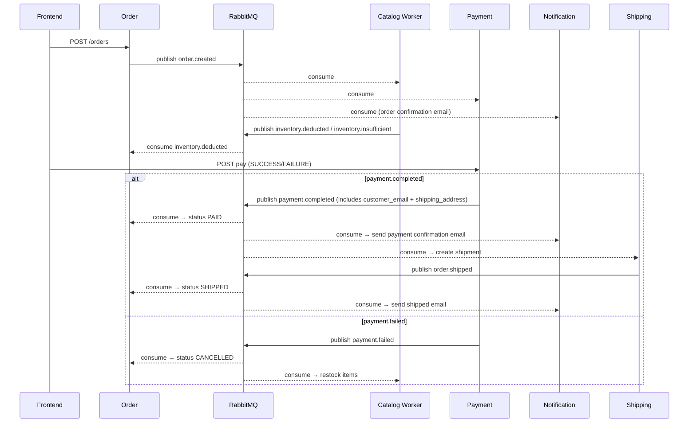

# Architecture Review — Current State

**Last Update**: 2026-06-24

---

## Maturity Scores

| Service | Score | Pattern |
|---------|-------|---------|
| Order (NestJS) | 9/10 | Strict Hexagonal |
| Review (NestJS) | 9/10 | Strict Hexagonal |
| Catalog (Laravel) | 8.5/10 | Pragmatic DDD |
| Notification (Node) | 8/10 | Hexagonal |
| Identity (Node) | 7/10 | Hexagonal |
| Payment (Node) | 7/10 | Hexagonal |
| Shipping (Node) | 7/10 | Hexagonal |

---

## Services Detail

### Order Service (NestJS) — 9/10
- **Domain**: `order.entity.ts` — pure aggregate, no framework imports, no crypto
- **Ports**: `IOrderRepository`, `IMessagePublisher`
- **Adapters**: TypeORM repository, RabbitMQ publisher + consumer (handles `inventory.deducted`, `inventory.insufficient`, `payment.completed`, `payment.failed`, `order.shipped`)
- **Anti-corruption**: `OrderMapper` ORM ↔ domain
- **Status**: `PENDING` → `PAID` → `SHIPPED` transitions driven by events
- **Gap**: `FindOrdersByCustomerUseCase` should return typed DTO
- **Vendor orders**: `GET /orders/vendor/:shopId` (returns orders with items matching shopId), `PATCH /orders/:id/ship` (PAID→SHIPPED)
- **Order items include shopId**: Optional field in JSONB `items` array — backward-compatible. `findByShopId()` filters in-memory (prototype ceiling, add DB index when slow)

### Review Service (NestJS) — 9/10
- Copied Order Service pattern exactly
- **Domain**: `Review.entity.ts` — id, productId, customerId, rating, text
- **Ports**: `IReviewRepository`
- **Adapters**: TypeORM repository, JWT auth guard on delete
- **API**: `POST /reviews`, `GET /products/:id/reviews`, `DELETE /reviews/:id`
- **Auth**: Admin deletes any review; user deletes only own

### Catalog Service (Laravel) — 8.5/10
- **Domain**: `Product.php`, `Shop.php` — `reduceStock()`, `setStock()`, domain exceptions
- **Use cases**: `CreateProductAction`, `DeductStockUseCase`, `UpdateStockUseCase`, `RestockProductUseCase`
- **Events**: Consumes `order.created` + `payment.failed`, publishes `inventory.deducted` + `inventory.insufficient`
- **API**: `GET/POST /api/products`, `GET /api/products/{id}`, `PATCH /api/products/{id}/stock`, `DELETE /api/products/{id}`
- **Shops**: `POST/GET /shops/my`, `GET /shops/{id}`, `GET /shops/{id}/products`, `GET /shops/admin/all`, `PATCH /shops/admin/{id}/approve`
- **Shop approval**: Admin-only endpoint; shops default to `pending`, vendors can only use approved shops
- **Listing enrichment**: `GET /api/products` now batch-loads shop names and attaches `shop: { id, name }` to each product
- **Stock auth**: `PATCH /api/products/{id}/stock` checks shop ownership — only the shop's vendor can update stock
- **Gap**: No explicit DTOs for request validation; generic `\Exception` used in some use cases instead of domain exceptions

### Cart Service (Express/Redis) — New
- **Stack**: Express + Redis (hash per user, key `cart:{userId}`, field `{productId}`)
- **API**: `GET/POST /cart/:userId/items`, `PATCH/DELETE /cart/:userId/items/:productId`, `DELETE /cart/:userId`
- **Items store**: `name`, `price`, `imageUrl`, `quantity`, `shopId`, `shopName` — JSON-encoded
- **Re-add merge**: Existing items update `shopId`/`shopName` on re-add (backfills stale entries)

### Coupon Module (NestJS, in Order Service)
- **Entity**: `CouponOrmEntity` with `shopId` (nullable) — TypeORM `synchronize: true`
- **API**: `POST /coupons`, `GET /coupons?shopId=X`, `POST /coupons/validate`
- **Scope**: `POST /coupons/validate` accepts `shopId` — rejects if coupon's `shopId` doesn't match
- **Vendor frontend**: `/vendor/coupons` page for creating and listing shop coupons

### Identity Service (Node) — 7/10
- Refactored from 86-line Express blob to hexagonal (2026-06-22)
- **Domain**: `User.entity.js` (id, email, password, role, isAdmin())
- **Use cases**: `RegisterUseCase` (bcrypt + duplicate check), `LoginUseCase` (bcrypt compare + JWT sign)
- **Adapters**: `PgUserRepository` (now supports custom ID for seed), `JwtProvider`
- **API**: `POST /register`, `POST /login`, `POST /become-vendor`
- **Seed**: 3 vendor users with fixed UUIDs matching catalog's ShopSeeder; password `password`
- **Gap**: No formal port interface JS classes (JSDoc only)

### Payment Service (Node) — 7.5/10
- Refactored from in-memory `Map` to persisted PostgreSQL (2026-06-22)
- **Domain**: `Payment.entity.js` (id, orderId, status, transactionId, amount, items, customerEmail, shippingAddress)
- **Use case**: `ProcessPaymentUseCase` — validates PENDING status, prevents double-processing, publishes `payment.completed`/`payment.failed` with customer details
- **Adapters**: `PgPaymentRepository` (UPSERT, JSONB items + shipping_address), RabbitMQ consumer (listens `order.created`, stores email + address), publisher
- **Queue**: `payment_service_orders` durable, named — no event loss on restart
- **Gap**: No port interface JS classes

### Shipping Service (Node) — 7/10
- New service (2026-06-22)
- **Domain**: `Shipment.entity.js` (id, orderId, trackingNumber, carrier, status)
- **Use case**: `CreateShipmentUseCase` — on `payment.completed`, generates FedEx tracking, saves, publishes `order.shipped`
- **Adapters**: `PgShipmentRepository`, RabbitMQ consumer + publisher
- **API**: `GET /shipments/:orderId`
- **Gap**: No port interface JS classes

### Notification Service (Node) — 8/10
- **Domain**: `EmailTemplate.js` — `formatOrderConfirmation()`, `formatOrderShipped()`, `formatPaymentConfirmation()`
- **Use cases**: `SendOrderEmailUseCase` (for `order.created`), `SendShippedEmailUseCase` (for `order.shipped`), `SendPaymentEmailUseCase` (for `payment.completed`)
- **Adapters**: RabbitMQ consumer (dispatches by routing key, bound to `order.created` + `order.shipped` + `payment.completed`), CatalogClient (HTTP), MailProvider (Nodemailer → MailHog)
- **Emails use real customer email** from event data (no longer hardcoded `customer@example.com`)
- **Queue**: `notification_emails` durable
- **Gap**: No formal port interface classes

---

## Saga Flow (Current)

---

## Docker Compose

| Service | DB Container | Port |
|---------|-------------|------|
| order-service | order-db (postgres:15) | 3001 |
| catalog-service | catalog-db (mysql:8) | 8000 |
| catalog-worker | — | — |
| identity-service | identity-db (postgres:15) | 3002 |
| payment-service | payment-db (postgres:15) | 3003 |
| review-service | review-db (postgres:15) | 4000 |
| shipping-service | shipping-db (postgres:15) | 4001 |
| notification-service | — | — |
| cart-service | redis | 3004 |
| frontend | — | 3000 |
| rabbitmq | — | 5672, 15672 |
| mailhog | — | 1025, 8025 |

---

## Phase 2 Additions (2026-06-24)

### Multi-Vendor Marketplace
- **Shops**: Vendors create shops (name, slug, description, logo) → admin approves → shop is `active`
- **Cart**: Items grouped by shop with checkbox selection. Only checked items proceed to checkout. Partial checkout removes only checked items from cart.
- **Admin repurposed**: Dashboard stripped to shop approval only (no stats/orders/users/coupons — those are vendor-owned)
- **Vendor frontend**: Dashboard (stock chart, low stock alerts), Products (CRUD + stock update), Orders (incoming with "Mark Shipped"), Coupons (shop-scoped create/list)
- **Order items**: Include `shopId` (optional JSONB field) — `findByShopId()` filters orders for vendor's order list
- **Coupons**: Scoped to shop via `shopId` column. Validate checks shop match. Vendors manage their own coupons.

### Seeding
- **3 vendors** auto-seeded with fixed UUIDs (`vendor1@example.com`, `vendor2@example.com`, `vendor3@example.com` / `password`)
- **3 approved shops** (Shop One/Two/Three) seeded with matching `owner_id`
- **140 products** split across shops (~40 each, balance in manually created shop)

## Remaining Improvements

### Quick Wins
- Formal port interfaces for Node.js services (JSDoc or JS classes)
- Stronger domain exceptions in Catalog (replace generic `\Exception` in `DeductStockUseCase`, `Product.php`)
- Return typed DTO from `FindOrdersByCustomerUseCase`

### Medium
- DLQ / nack strategy across all consumers
- Centralized DI bindings in Laravel `AppServiceProvider` for all Actions
- Multi-shop checkout — split order into per-shop sub-orders when items from different shops are checked out together

### Future
- CQRS separation
- Event sourcing
- API gateway with centralized auth
