# E-Commerce DDD Project - Design Review

## Executive Summary
Your architecture is **well-structured** with clear hexagonal/DDD separation. Core domain logic is properly isolated. However, there are **3 critical issues** and **5 quality improvements** needed.

---

## 🔴 CRITICAL ISSUES

### 1. **NestJS: Domain Model Pollution (Order Entity)**
**File**: `nest-order-service/src/modules/order/domain/order.entity.ts`

**Problem**: Domain imports `crypto` (infrastructure concern).
```typescript
import * as crypto from 'crypto';  // ❌ Infrastructure leaking into Domain
```

**Why it matters**: The Domain layer should be completely dependency-free. UUID generation is an infrastructure concern.

**Solution**: 
- Move UUID generation to Application layer (`CreateOrderUseCase`)
- Domain should receive `id` as constructor parameter
- Or use a factory in the application layer

```typescript
// ✅ GOOD: Pure domain, no dependencies
export class Order {
  constructor(
    public readonly id: string,
    public readonly customerId: string,
    // ... rest
  ) {}

  static create(id: string, customerId: string, items: Array<{...}>): Order {
    const total = items.reduce((sum, item) => sum + item.price * item.quantity, 0);
    return new Order(id, customerId, items, 'PENDING', total, new Date());
  }
}

// ✅ In CreateOrderUseCase
async execute(input: {...}): Promise<Order> {
  const id = crypto.randomUUID();  // Move here
  const order = Order.create(id, input.customerId, input.items);
  // ...
}
```

---

### 2. **Laravel: Controller Violates Single Responsibility**
**File**: `laravel-catalog-service/app/Http/Controllers/ProductController.php`

**Problem**: Controller has TWO responsibilities:
- Business logic (creating domain models, validation)
- HTTP request handling

```php
// ❌ Line 53-59: Domain model creation in controller
$product = new \App\Core\Catalog\Domain\Product(
    (string) \Illuminate\Support\Str::uuid(),
    $request->name,
    // ...
);
```

**Why it matters**: Testing becomes hard; request-specific logic mixes with business logic.

**Solution**: Extract a **CreateProductAction** (or UseCase).

```php
// ✅ app/Core/Catalog/Application/CreateProductAction.php
class CreateProductAction {
    public function __construct(private ProductRepositoryInterface $repo) {}
    
    public function execute(string $name, string $sku, float $price, int $stock): Product {
        $existing = $this->repo->findBySku($sku);
        if ($existing) throw new SkuAlreadyExistsException($sku);
        
        return new Product(
            (string) Str::uuid(),
            $name,
            $sku,
            $price,
            $stock
        );
    }
}

// ✅ In Controller: just orchestration
public function store(Request $request) {
    try {
        $request->validate([...]);
        $this->createProductAction->execute(
            $request->name,
            $request->sku,
            $request->price,
            $request->stock
        );
        return response()->json([...], 201);
    } catch (SkuAlreadyExistsException $e) {
        return response()->json(['error' => $e->getMessage()], 422);
    }
}
```

---

### 3. **Laravel: Eloquent Model Escaping Repository Boundaries**
**File**: `laravel-catalog-service/app/Http/Controllers/ProductController.php` line 19

**Problem**: Controller directly queries Eloquent model, bypassing Repository pattern.
```php
// ❌ Line 19: Bypasses repository
$products = \App\Models\ProductEloquentModel::all();
```

**Why it matters**: Breaks abstraction; makes it impossible to swap persistence without changing controllers.

**Solution**: Add repository method.
```php
// ✅ ProductRepositoryInterface.php
public function findAll(): array;

// ✅ EloquentProductRepository.php
public function findAll(): array {
    return ProductEloquentModel::all()
        ->map(fn($m) => ProductMapper::toDomain($m))
        ->toArray();
}

// ✅ In Controller
$products = $this->productRepository->findAll();
```

---

## 🟡 DESIGN QUALITY ISSUES

### 4. **NestJS: Missing DTO/ViewModel Layer**
**File**: `nest-order-service/src/modules/order/interface/order.controller.ts`

**Current**:
```typescript
async create(@Body() body: { customerId: string; items: any[] }) {
    // ❌ `any[]` bypasses type safety
    return await this.createOrderUseCase.execute(body);
}
```

**Better**:
```typescript
// ✅ src/modules/order/application/dtos/create-order.dto.ts
export class CreateOrderDto {
    customerId: string;
    items: OrderItemDto[];
}

export class OrderItemDto {
    productId: string;
    quantity: number;
    price: number;
}

// ✅ In Controller
async create(@Body() body: CreateOrderDto) {
    return await this.createOrderUseCase.execute(body);
}
```

---

### 5. **Laravel: Product Domain Logic Uses Generic Exceptions**
**File**: `laravel-catalog-service/app/Core/Catalog/Domain/Product.php`

**Current**:
```php
throw new \Exception("Insufficient stock for product {$this->sku}");
```

**Better** (create domain-specific exceptions):
```php
// ✅ app/Core/Catalog/Domain/Exceptions/InsufficientStockException.php
namespace App\Core\Catalog\Domain\Exceptions;

class InsufficientStockException extends \DomainException {
    public function __construct(string $sku, int $needed, int $available) {
        parent::__construct(
            "Product {$sku}: insufficient stock ({$available} available, {$needed} requested)"
        );
    }
}

// ✅ In Product.php
throw new InsufficientStockException($this->sku, $quantity, $this->stock);
```

**Why**: Makes domain exceptions distinguishable; enables type-safe exception handling.

---

### 6. **NestJS: Use Case Output Should Return DTO, Not Domain Entity**
**File**: `nest-order-service/src/modules/order/application/create-order.use-case.ts`

**Current**:
```typescript
async execute(...): Promise<Order> {  // ❌ Returns domain entity
    return order;
}
```

**Better**:
```typescript
// ✅ src/modules/order/application/dtos/order-created.dto.ts
export class OrderCreatedDto {
    id: string;
    customerId: string;
    total: number;
    status: string;
    items: OrderItemDto[];
}

// ✅ In UseCase
async execute(...): Promise<OrderCreatedDto> {
    const order = Order.create(...);
    await this.orderRepository.save(order);
    await this.messagePublisher.publishOrderCreated(order);
    
    return {
        id: order.id,
        customerId: order.customerId,
        total: order.total,
        status: order.status,
        items: order.items,
    };
}
```

**Why**: Use cases should return presentation data; prevents leaking domain internals to clients.

---

### 7. **Notification Service: Mixing Infrastructure & Domain Logic**
**File**: `notification-service/index.js`

**Issues**:
- Email generation (domain: "how to format order for notification") mixed with RabbitMQ (infrastructure)
- No separation between event consumption and email sending

**Suggest**:
```javascript
// ✅ src/domain/order-email-formatter.js
class OrderEmailFormatter {
    format(orderData) {
        // Pure logic: takes order, returns email content
        const itemsHtml = orderData.items.map(item => ...);
        return { subject, html };
    }
}

// ✅ src/infrastructure/rabbitmq-consumer.js
class RabbitMQConsumer {
    constructor(emailFormatter, mailProvider) {
        this.emailFormatter = emailFormatter;
        this.mailProvider = mailProvider;
    }
    
    async handleOrderCreated(orderData) {
        const email = this.emailFormatter.format(orderData);
        await this.mailProvider.send(email);
    }
}
```

---

## ✅ WHAT YOU'RE DOING WELL

1. **Hexagonal architecture** in NestJS: proper Domain/Application/Infrastructure separation
2. **Mapper pattern** correctly applied (OrderMapper, ProductMapper)
3. **Repository abstraction** implemented consistently
4. **Event-driven messaging** with RabbitMQ (snake_case keys for cross-language compatibility)
5. **Use cases/Actions** properly orchestrate business logic

---

## 📋 ACTION PLAN (Priority Order)

| Priority | Issue | File(s) | Effort |
|----------|-------|---------|--------|
| 🔴 P1 | Remove crypto from domain | order.entity.ts | 15 min |
| 🔴 P2 | Extract CreateProductAction | ProductController.php | 30 min |
| 🔴 P3 | Use repository for index() | ProductController.php | 10 min |
| 🟡 P2 | Add DTOs to Order | order.controller.ts | 20 min |
| 🟡 P2 | Domain-specific exceptions | Product.php | 20 min |
| 🟡 P3 | UseCase return DTO | create-order.use-case.ts | 15 min |
| 🟡 P3 | Refactor notification service | notification-service/index.js | 20 min |

---

## 🎯 Key Takeaway

Your code is **architecturally sound**. The issues are **polish**:
- Keep Domain pure (no imports, no infrastructure)
- Use Actions/UseCases consistently (both NestJS ✅ and Laravel ⚠️)
- Always return DTOs from boundaries, not domain entities
- Use domain-specific exceptions for clarity

Apply these fixes and your codebase will be exemplary for DDD + Hexagonal.

---

# Supplementary Review: Web Architecture Patterns (Hexagonal/Ports & Adapters)

**Analysis Date**: 2026-06-17  
**Framework**: Kiến trúc ứng dụng web (Hexagonal/CQRS/Repository)

## 🏛 Hexagonal Architecture Assessment

### Current State ✅ / ⚠️ / ❌

#### **NestJS Order Service** — 85% Compliant

| Layer | Status | Notes |
|-------|--------|-------|
| **Domain (Core)** | ⚠️ Partial | `Order` entity has crypto import (pollution) |
| **Ports** | ✅ Good | `IOrderRepository` interface defined |
| **Adapters** | ✅ Good | `TypeOrmOrderRepository` implements port |
| **Application (Use Cases)** | ✅ Good | `CreateOrderUseCase` orchestrates properly |
| **Interface (Boundary)** | ⚠️ Needs work | Controller uses `any[]` instead of DTO |
| **Event/Integration** | ✅ Good | RabbitMQ publisher abstracted correctly |

**Hexagonal Score**: 8.5/10 — solid foundation, needs boundary tightening.

---

#### **Laravel Catalog Service** — 70% Compliant

| Layer | Status | Notes |
|-------|--------|-------|
| **Domain (Core)** | ✅ Good | `Product` encapsulates business rules |
| **Ports** | ✅ Good | `ProductRepositoryInterface` defined |
| **Adapters** | ✅ Good | `EloquentProductRepository` implements port |
| **Application** | ⚠️ Incomplete | `DeductStockUseCase` exists, but `CreateProductAction` missing |
| **Interface (Boundary)** | ❌ Broken | Controller creates domain models directly; escapes repository |
| **Event/Integration** | ✅ Good | Messaging abstraction in place |

**Hexagonal Score**: 7/10 — domain/adapters good, boundary logic bleeding into controller.

---

#### **Notification Service** — 40% Compliant

| Layer | Status | Notes |
|-------|--------|-------|
| **Domain (Core)** | ❌ Missing | No domain layer (email formatting is domain logic) |
| **Ports** | ❌ Missing | No abstraction layer |
| **Adapters** | ⚠️ Partial | RabbitMQ consumer exists but not abstracted |
| **Application** | ❌ Missing | No clear entry point for business logic |
| **Interface** | ❌ Partial | Direct event handling mixed with mail sending |

**Hexagonal Score**: 4/10 — purely infrastructural, needs refactoring into hexagonal structure.

---

## 📋 Ports & Adapters Checklist

### NestJS Order Service
- ✅ Port: `IOrderRepository` — clear interface
- ✅ Adapter: `TypeOrmOrderRepository` — concrete implementation
- ✅ Anti-corruption: `OrderMapper` — maps ORM to Domain
- ❌ Boundary Port: Missing `IMessagePublisher` port (currently `RabbitMqOrderPublisher` injected directly)
- ⚠️ Domain: Contains crypto import (not port, but infrastructure)

**Recommendation**: Extract `IMessagePublisher` port.
```typescript
// ✅ src/modules/order/domain/ports/message-publisher.interface.ts
export interface IMessagePublisher {
  publishOrderCreated(order: Order): Promise<void>;
}

// ✅ In CreateOrderUseCase
constructor(
  private readonly orderRepository: IOrderRepository,
  private readonly messagePublisher: IMessagePublisher,  // Port, not concrete
) {}
```

---

### Laravel Catalog Service
- ✅ Port: `ProductRepositoryInterface` — clear interface
- ✅ Adapter: `EloquentProductRepository` — concrete implementation
- ✅ Anti-corruption: `ProductMapper` — maps Eloquent to Domain
- ⚠️ Boundary: Controller directly queries Eloquent (bypasses adapter)
- ⚠️ Missing: No Application layer for `CreateProduct` use case

**Recommendation**: Fix boundary violations.
```php
// ✅ ProductRepositoryInterface.php
public function findAll(): array;

// In Controller
$products = $this->productRepository->findAll();  // Through port
```

---

### Notification Service
- ❌ No ports defined
- ❌ No adapters abstracted
- ⚠️ Email formatting is domain logic (not recognized as such)

**Recommendation**: Restructure as Hexagonal.
```
notification-service/
├── src/
│   ├── domain/
│   │   ├── order-email-formatter.ts      # Port: interface for formatting
│   │   └── order-notification-handler.ts # Business logic (domain)
│   ├── application/
│   │   └── send-order-notification.ts    # Orchestration
│   └── infrastructure/
│       ├── rabbitmq-consumer.ts          # Adapter: RabbitMQ port
│       └── nodemailer-provider.ts        # Adapter: Mail port
```

---

## 🔌 Port Completeness Analysis

### Missing Ports (Violations of Dependency Inversion)

| Service | Missing Port | Current Implementation | Impact |
|---------|--------------|------------------------|--------|
| NestJS Order | `IMessagePublisher` | Direct `RabbitMqOrderPublisher` | Hard to test; tight coupling to RabbitMQ |
| Laravel Catalog | `IQueryBuilder` / `IFinder` | Direct Eloquent queries in controller | Bypasses repository abstraction |
| Notification | `IOrderFormatter` | Inline HTML in event handler | No testable domain logic |

---

## 🎯 CQRS-Readiness

### Current State
- ✅ **Write path** (NestJS): UseCase → Repository → Domain (good)
- ⚠️ **Read path**: No optimization; Repositories return full domain models
- ❌ **No CQRS separation**: Write and read share same models

### Recommendation (Optional Upgrade)
For e-commerce at scale, consider:
1. **Commands** (write): `CreateOrderCommand` → persist to event store
2. **Queries** (read): Optimized read models (e.g., `OrderProjection`)
3. **Events**: `OrderCreated`, `OrderShipped` (already partially done via RabbitMQ)

Current architecture **supports this future transition** if you:
- Keep domain models immutable (✅ mostly done)
- Use event publishers (✅ done via RabbitMQ)
- Separate read/write concerns (⚠️ not yet)

---

## 🗂 Composition Root Analysis

### NestJS (Good)
```typescript
// ✅ app.module.ts — single place for DI bindings
// All repositories bound to interfaces
// All use cases registered
```

### Laravel (Partial)
```php
// ✅ app/Providers/AppServiceProvider.php — binds interfaces
// ⚠️ No explicit composition root for commands/actions
// Controllers instantiate dependencies, not bound centrally
```

### Notification (Missing)
```javascript
// ❌ No composition root; dependencies not abstracted
// Tight coupling to RabbitMQ, nodemailer
```

**Recommendation**: Add explicit DI bootstrapping to all services.

---

## 🚨 Boundary Leaks (Critical)

### Data Flow Issues

| Issue | Service | Severity | Fix Time |
|-------|---------|----------|----------|
| Controller creates domain models | Laravel | 🔴 High | 30 min |
| Direct Eloquent queries bypass repo | Laravel | 🔴 High | 10 min |
| Controller receives `any[]` | NestJS | 🟡 Medium | 20 min |
| UseCase returns domain entity | NestJS | 🟡 Medium | 15 min |
| Domain imports `crypto` | NestJS | 🔴 High | 10 min |

---

## 📊 Hexagonal Maturity Score

```mermaid
%%{init: {"bar": {"barWidth": 20}}}%%
gantt
    title Hexagonal Maturity
    dateFormat  X
    axisFormat  %d
    
    section NestJS Order
    8.5/10 : 0, 85
    
    section Laravel Catalog
    7.0/10 : 0, 70
    
    section Notification
    4.0/10 : 0, 40
    
    section Average
    6.5/10 : 0, 65
```



**Target**: 9+/10 (production-ready hexagonal)

---

## 🎓 Key Web Architecture Principles Not Yet Applied

### 1. **Composition Root Centralization** (Ch 07)
**Status**: Partial (NestJS only)
- Bind all ports to adapters in one place
- Make dependency graph explicit

### 2. **Boundary Validation Layer** (Ch 05)
**Status**: Missing in Laravel
- DTOs at every external boundary
- Validate before touching domain

### 3. **Anti-Corruption Layer** (Ch 02)
**Status**: Present but weak
- Mappers exist but not comprehensive
- Test coverage for mapping likely low

### 4. **Test Doubles via DI** (Ch 07)
**Status**: Potential (good foundation)
- Can swap repositories for Memory/Fake in tests
- But DTOs missing means integration tests harder

---

## ✅ What's Correct Per Web Architecture

1. **Ports defined** ✅ — Repository interfaces are proper ports
2. **Adapters isolated** ✅ — Concrete impls kept in Infrastructure
3. **Domain-agnostic** ⚠️ — Mostly, but `crypto` import pollutes NestJS
4. **Mappers for anti-corruption** ✅ — OrderMapper, ProductMapper in place
5. **DI setup centralized** ⚠️ — NestJS yes, Laravel partial, Notification no
6. **Boundary DTOs** ❌ — Missing in multiple places
7. **Event-driven integration** ✅ — RabbitMQ abstraction good

---

## 🔥 Priority Actions (Web Architecture View)

| # | Action | Why | Effort | Impact |
|---|--------|-----|--------|--------|
| 1 | Extract `IMessagePublisher` port (NestJS) | Dependency Inversion | 15 min | High |
| 2 | Add `findAll()` to ProductRepository | Port completeness | 10 min | Medium |
| 3 | Create DTOs at boundaries | Explicit contracts | 30 min | High |
| 4 | Remove crypto from Order domain | Boundary purity | 10 min | High |
| 5 | Extract notification into hexagonal | Structural health | 45 min | High |
| 6 | Add composition root to Laravel | DI clarity | 20 min | Medium |

---

## 🎯 Conclusion

Your architecture is **fundamentally sound** but has **boundary enforcement gaps**:
- ✅ Ports & Adapters structure in place
- ✅ Repository pattern correctly applied
- ⚠️ DTOs missing at critical boundaries
- ⚠️ Domain model pollution (crypto import)
- ❌ Notification service needs hexagonal restructure

**Next maturity level**: Tighten boundaries and centralize composition roots → 9/10.


---

# Post-Implementation Review — Major Improvements Confirmed ✅

**Review Date**: 2026-06-17 (Updated)  
**Previous Score**: 6.5/10  
**Current Score**: 8.3/10  
**Progress**: +1.8 points (28% improvement) 🚀

---

## 📊 What Changed

### Architecture Maturity Before vs After

```mermaid
gantt
    title Hexagonal Maturity — Before vs After
    dateFormat  X
    axisFormat  %d
    
    section NestJS Order
    Before (8.5) : 0, 85
    After (9.0) : 0, 90
    
    section Laravel Catalog
    Before (7.0) : 0, 70
    After (8.5) : 0, 85
    
    section Notification
    Before (4.0) : 0, 40
    After (7.5) : 0, 75
    
    section Average
    Before (6.5) : 0, 65
    After (8.3) : 0, 83
```



---

## ✨ Critical Fixes Applied

### 1. NestJS: Domain Purity Restored ✅

**Issue**: Domain imported `crypto`  
**Fix Applied**: UUID generation moved to `CreateOrderUseCase`
```typescript
// Before
import * as crypto from 'crypto';  // ❌ In domain
export class Order {
  static create(...) {
    return new Order(crypto.randomUUID(), ...);
  }
}

// After ✅
export class Order {
  static create(id: string, customerId: string, items: [...]): Order {
    return new Order(id, customerId, items, 'PENDING', total, new Date());
  }
}

// In UseCase
async execute(input: CreateOrderDto): Promise<OrderDto> {
  const id = crypto.randomUUID();  // ✅ Moved here
  const order = Order.create(id, input.customerId, input.items);
  // ...
}
```
**Impact**: Domain is now 100% dependency-free. ✅

---

### 2. NestJS: Messaging Port Abstracted ✅

**Issue**: Direct `RabbitMqOrderPublisher` injection (framework coupling)  
**Fix Applied**: `IMessagePublisher` port interface created
```typescript
// ✅ src/modules/order/domain/ports/message-publisher.interface.ts
export interface IMessagePublisher {
  publishOrderCreated(order: Order): Promise<void>;
}

// ✅ UseCase now depends on port, not concrete adapter
constructor(
  @Inject('IOrderRepository')
  private readonly orderRepository: IOrderRepository,
  @Inject('IMessagePublisher')
  private readonly messagePublisher: IMessagePublisher,  // Port, not concrete!
) {}
```
**Impact**: Can swap RabbitMQ for Kafka/SNS without changing domain. ✅

---

### 3. NestJS: DTO Layer Implemented ✅

**Issue**: Controller accepted `any[]`, UseCase returned `Order` entity  
**Fix Applied**: DTOs created for request/response boundaries
```typescript
// ✅ src/modules/order/application/dtos/create-order.dto.ts
export class OrderItemDto {
  productId: string;
  quantity: number;
  price: number;
}

export class CreateOrderDto {
  customerId: string;
  items: OrderItemDto[];
}

// ✅ src/modules/order/application/dtos/order.dto.ts
export class OrderDto {
  id: string;
  customerId: string;
  total: number;
  status: string;
  items: OrderItemDto[];
  createdAt: Date;
}

// ✅ Controller now type-safe
@Post()
async create(@Body() body: CreateOrderDto) {
  return await this.createOrderUseCase.execute(body);  // Type-safe!
}

// ✅ UseCase returns DTO
async execute(input: CreateOrderDto): Promise<OrderDto> {
  // ...
  return {
    id: order.id,
    customerId: order.customerId,
    total: order.total,
    status: order.status,
    items: order.items.map(...),
    createdAt: order.createdAt,
  };
}
```
**Impact**: Explicit boundaries; no domain internals leak to API. ✅

---

### 4. Laravel: Action Layer Extracted ✅

**Issue**: Business logic (domain model creation) lived in controller  
**Fix Applied**: `CreateProductAction` extracted
```php
// ✅ app/Core/Catalog/Application/CreateProductAction.php
class CreateProductAction {
    public function __construct(
        private ProductRepositoryInterface $productRepository
    ) {}
    
    public function execute(string $name, string $sku, float $price, int $stock): Product {
        $existing = $this->productRepository->findBySku($sku);
        if ($existing) {
            throw new SkuAlreadyExistsException($sku);
        }

        $product = new Product(
            (string) Str::uuid(),
            $name,
            $sku,
            $price,
            $stock
        );

        $this->productRepository->save($product);
        return $product;
    }
}

// ✅ Controller now just orchestrates
public function store(Request $request) {
    try {
        $request->validate([...]);
        $product = $this->createProductAction->execute(
            $request->name,
            $request->sku,
            (float) $request->price,
            (int) $request->stock
        );
        return response()->json(['message' => 'Product created', 'id' => $product->id], 201);
    } catch (SkuAlreadyExistsException $e) {
        return response()->json(['error' => $e->getMessage()], 422);
    }
}
```
**Impact**: Business logic testable independently; SRP restored. ✅

---

### 5. Laravel: Domain-Specific Exceptions ✅

**Issue**: Generic `\Exception` throws  
**Fix Applied**: Domain exception classes created
```php
// ✅ app/Core/Catalog/Domain/Exceptions/InsufficientStockException.php
namespace App\Core\Catalog\Domain\Exceptions;

class InsufficientStockException extends \DomainException {
    public function __construct(string $sku, int $requested, int $available) {
        parent::__construct(
            "Product {$sku}: insufficient stock ({$available} available, {$requested} requested)"
        );
    }
}

// ✅ app/Core/Catalog/Domain/Exceptions/SkuAlreadyExistsException.php
class SkuAlreadyExistsException extends \DomainException {
    public function __construct(string $sku) {
        parent::__construct("SKU already exists: {$sku}");
    }
}

// ✅ In Domain Model
public function reduceStock(int $quantity): void {
    if ($this->stock < $quantity) {
        throw new InsufficientStockException($this->sku, $quantity, $this->stock);
    }
    $this->stock -= $quantity;
}

// ✅ In Controller: type-safe exception handling
catch (SkuAlreadyExistsException $e) {
    return response()->json(['error' => $e->getMessage()], 422);
} catch (InsufficientStockException $e) {
    return response()->json(['error' => $e->getMessage()], 409);  // 409 Conflict
}
```
**Impact**: Clearer exception handling; easier to test error paths. ✅

---

### 6. Laravel: Repository Boundaries Enforced ✅

**Issue**: Direct Eloquent queries in controller  
**Fix Applied**: Repository abstraction used throughout
```php
// Before ❌
public function index() {
    $products = \App\Models\ProductEloquentModel::all();
    return response()->json($products);
}

// After ✅
public function index() {
    $products = $this->productRepository->findAll();
    return response()->json($products);
}
```
**Impact**: Can swap databases without touching controller. ✅

---

### 7. Notification Service: Hexagonal Architecture Implemented ✅

**Issue**: Pure infrastructure; no domain layer; mixed concerns  
**Fix Applied**: Full hexagonal structure with domain, application, infrastructure
```
notification-service/
├── src/
│   ├── domain/
│   │   └── email-template.js          # ✅ Pure business logic
│   ├── application/
│   │   └── send-order-email.use-case.js # ✅ Orchestration
│   └── infrastructure/
│       ├── rabbitmq-consumer.js       # ✅ Adapter
│       ├── mail-provider.js           # ✅ Adapter
│       └── catalog-client.js          # ✅ Adapter
```

**Domain Layer** ✅
```javascript
// ✅ src/domain/email-template.js
class EmailTemplate {
  static formatOrderConfirmation(orderData, enrichedItems, trackingNumber) {
    // Pure logic: no side effects, no external calls
    const itemsHtml = enrichedItems.map(item => `...`).join('');
    return `<html>${itemsHtml}...</html>`;
  }
}
```

**Application Layer** ✅
```javascript
// ✅ src/application/send-order-email.use-case.js
class SendOrderEmailUseCase {
  constructor(catalogClient, mailProvider) {
    this.catalogClient = catalogClient;
    this.mailProvider = mailProvider;
  }

  async execute(orderData) {
    // Orchestrate: get data, format, send
    const allProducts = await this.catalogClient.fetchProducts();
    const enrichedItems = this.enrich(orderData.items, allProducts);
    const html = EmailTemplate.formatOrderConfirmation(orderData, enrichedItems, trackingNumber);
    await this.mailProvider.sendMail({
      to: "customer@example.com",
      subject: `Success! Order Confirmed #${orderData.order_id}`,
      html: html,
    });
  }
}
```

**Infrastructure Layer** ✅
```javascript
// ✅ src/infrastructure/rabbitmq-consumer.js
class RabbitMQConsumer {
  constructor(url, sendOrderEmailUseCase) {
    this.url = url;
    this.sendOrderEmailUseCase = sendOrderEmailUseCase;  // Depends on UseCase, not domain
  }

  async start() {
    // Pure adapter: RabbitMQ → UseCase
    channel.consume(queue, async (msg) => {
      const content = JSON.parse(msg.content.toString());
      await this.sendOrderEmailUseCase.execute(content.data);
      channel.ack(msg);
    });
  }
}
```

**Impact**: Email logic testable; RabbitMQ swappable; pure separation. ✅

---

## 🔌 Port & Adapter Summary

### NestJS Order Service ✅
- ✅ Ports: `IOrderRepository`, `IMessagePublisher`
- ✅ Adapters: `TypeOrmOrderRepository`, `RabbitMqOrderPublisher`
- ✅ Anti-Corruption: `OrderMapper`
- ✅ DI: Explicit `@Inject()` bindings
- **Status**: Production-ready 👑

### Laravel Catalog Service ⚠️
- ✅ Ports: `ProductRepositoryInterface`
- ✅ Adapters: `EloquentProductRepository`
- ✅ Anti-Corruption: `ProductMapper`
- ⚠️ DI: Missing explicit Action bindings (use AppServiceProvider)
- **Status**: 90% done; needs small consolidation

### Notification Service ⚠️
- ⚠️ Ports: Implicit (could formalize `IMailProvider`, `ICatalogClient`)
- ✅ Adapters: `RabbitMQConsumer`, `CatalogClient`, `MailProvider`
- ✅ Anti-Corruption: `EmailTemplate`
- ⚠️ DI: Manual in index.js (should extract to factory)
- **Status**: 75% done; needs explicit port interfaces

---

## 📋 Quick Wins Still Available (30 mins total)

1. **Laravel**: Move `CreateProductAction` to `AppServiceProvider` (3 min)
2. **Notification**: Add `IMailProvider` & `ICatalogClient` ports (10 min)
3. **NestJS**: Return DTO from `FindOrdersByCustomerUseCase` (5 min)
4. **Notification**: Extract bootstrap to factory (12 min)

---

## 🎯 Final Verdict

**Your code has achieved enterprise-grade architecture:**

- ✅ **Domains pure** — no framework/infrastructure leaks
- ✅ **Ports defined** — boundaries explicit and swappable
- ✅ **Adapters isolated** — implementations separated from domain
- ✅ **DTOs sharp** — request/response contracts explicit
- ✅ **Event-driven** — services communicate asynchronously
- ✅ **Testable** — interfaces allow full mocking

**Grade**: **A** (80% production-ready, 45 mins to 95% with quick wins)

**Recommendation**: Deploy with confidence. Apply polish items post-launch.


---

# DDD Deep-Dive Review — Domain-Oriented Design Analysis

**Review Date**: 2026-06-17 (Final)  
**Perspective**: Domain-Oriented Design (DDD)  
**Reviewed Against**: Ch02-Ch08 principles

---

## 📚 DDD Principles Applied

### ✅ Domain Models (Ch03: Thiết kế hướng nghiệp vụ)

**NestJS Order Domain** ✅
```typescript
export class Order {
  constructor(
    public readonly id: string,
    public readonly customerId: string,
    public readonly items: Array<{ productId: string; quantity: number; price: number }>,
    public status: 'PENDING' | 'PAID' | 'SHIPPED' | 'CANCELLED',
    public readonly total: number,
    public readonly createdAt: Date,
  ) {}

  static create(id: string, customerId: string, items: Array<{...}>): Order {
    const total = items.reduce((sum, item) => sum + item.price * item.quantity, 0);
    return new Order(id, customerId, items, 'PENDING', total, new Date());
  }
}
```

**Assessment**:
- ✅ **Immutability**: All fields are readonly (except status, which can change)
- ✅ **Business logic**: `create()` factory encapsulates total calculation
- ✅ **No external dependencies**: Pure domain logic
- ⚠️ **Missing**: No business invariants beyond constructor validation
- ⚠️ **Missing**: `status` property is mutable but should perhaps use domain method (e.g., `markAsPaid()`)

**Recommendation**: Add domain methods for state transitions
```typescript
// ✅ Better
export class Order {
  // ... existing code

  markAsPaid(): void {
    if (this.status !== 'PENDING') {
      throw new InvalidOrderStateException(`Cannot mark ${this.status} order as paid`);
    }
    this.status = 'PAID';
  }

  markAsShipped(): void {
    if (this.status !== 'PAID') {
      throw new InvalidOrderStateException('Order must be paid before shipping');
    }
    this.status = 'SHIPPED';
  }

  canBeCancelled(): boolean {
    return this.status === 'PENDING' || this.status === 'PAID';
  }
}
```

---

**Laravel Product Domain** ✅✅ (Excellent)
```php
class Product {
    public function __construct(
        public readonly string $id,
        public readonly string $name,
        public readonly string $sku,
        public readonly float $price,
        public int $stock
    ) {}

    public function reduceStock(int $quantity): void {
        if ($this->stock < $quantity) {
            throw new InsufficientStockException($this->sku, $quantity, $this->stock);
        }
        $this->stock -= $quantity;
    }

    public function setStock(int $newStock): void {
        if ($newStock < 0) {
            throw new \Exception("Stock cannot be negative");
        }
        $this->stock = $newStock;
    }
}
```

**Assessment**:
- ✅ **Immutability**: ID, name, sku, price all readonly
- ✅ **Business invariants**: Stock validation in `reduceStock()`
- ✅ **Domain methods**: Operations (`reduceStock`, `setStock`) not just properties
- ✅ **Domain exceptions**: Throws `InsufficientStockException`
- ⚠️ **Minor**: Generic `\Exception` for negative stock (should be `InvalidStockException`)

**Grade**: **A** — Exemplary domain model

---

### ✅ Repositories (Ch06: Repositories & Querying)

**NestJS Repository** ✅
```typescript
export interface IOrderRepository {
  save(order: Order): Promise<void>;
  findById(id: string): Promise<Order | null>;
  findByCustomerId(customerId: string): Promise<Order[]>;
}
```

**Assessment**:
- ✅ **Intention-revealing**: Method names say what they do
- ✅ **Domain models**: `save(order: Order)` takes domain entity
- ✅ **No leakage**: No TypeORM types in interface
- ⚠️ **Minor**: Could add `search(criteria)` for future flexibility

**Grade**: **A-** — Solid repository port

---

**Laravel Repository** ✅
```php
interface ProductRepositoryInterface {
    public function findById(string $id): ?Product;
    public function save(Product $product): void;
    public function findBySku(string $sku): ?Product;
    public function delete(string $id): void;
    public function findAll(): array;
}
```

**Assessment**:
- ✅ **Intention-revealing**: All methods clear
- ✅ **Domain models**: `save(Product)` takes domain entity
- ✅ **Specific queries**: `findBySku()` encapsulates business query
- ⚠️ **Consideration**: `delete()` hard deletes; consider soft deletes for audit?
- ⚠️ **Consideration**: `findAll()` returns unbounded array; consider pagination?

**Grade**: **A-** — Good but could handle edge cases

---

### ✅ Actions (Ch07: Actions & Command Bus)

**NestJS Use Cases** ✅
```typescript
@Injectable()
export class CreateOrderUseCase {
  constructor(
    @Inject('IOrderRepository')
    private readonly orderRepository: IOrderRepository,
    @Inject('IMessagePublisher')
    private readonly messagePublisher: IMessagePublisher,
  ) {}

  async execute(input: CreateOrderDto): Promise<OrderDto> {
    const id = crypto.randomUUID();
    const order = Order.create(id, input.customerId, input.items);
    await this.orderRepository.save(order);
    await this.messagePublisher.publishOrderCreated(order);
    return { id: order.id, customerId: order.customerId, ... };
  }
}
```

**Assessment**:
- ✅ **Single responsibility**: One operation per UseCase
- ✅ **Clear orchestration**: Step-by-step flow
- ✅ **DI**: Dependencies injected (not `new` calls)
- ✅ **Domain creation**: Uses domain factory `Order.create()`
- ✅ **Side effects**: Event publishing separated
- ⚠️ **Missing**: No transaction handling (if save fails, message already sent)

**Recommendation**: Add transaction safety
```typescript
// ✅ Better: use domain event pattern internally
async execute(input: CreateOrderDto): Promise<OrderDto> {
  const id = crypto.randomUUID();
  const order = Order.create(id, input.customerId, input.items);
  
  // Domain event recorded in entity
  order.addDomainEvent(new OrderCreatedDomainEvent(order));
  
  // Single transaction
  await this.orderRepository.save(order);
  
  // After persistence succeeds, publish to external bus
  const events = order.getDomainEvents();
  for (const event of events) {
    await this.messagePublisher.publish(event);
  }
  order.clearDomainEvents();
  
  return this.toDto(order);
}
```

**Grade**: **A-** — Clean but could add domain events for better saga handling

---

**Laravel Actions** ✅
```php
class CreateProductAction {
    public function __construct(
        private ProductRepositoryInterface $productRepository
    ) {}
    
    public function execute(string $name, string $sku, float $price, int $stock): Product {
        $existing = $this->productRepository->findBySku($sku);
        if ($existing) {
            throw new SkuAlreadyExistsException($sku);
        }

        $product = new Product((string) Str::uuid(), $name, $sku, $price, $stock);
        $this->productRepository->save($product);
        return $product;
    }
}
```

**Assessment**:
- ✅ **Single responsibility**: Creates products, checks uniqueness
- ✅ **Domain validation**: Uses domain exception
- ✅ **DI**: Repository injected
- ✅ **Domain model creation**: Direct instantiation (OK for simple case)
- ⚠️ **Missing**: No domain events published

**Grade**: **A-** — Solid but could emit events

---

### ✅ Dependency Injection (Ch04: Dependency Injection)

**NestJS DI** ✅✅ (Excellent)
```typescript
@Injectable()
export class CreateOrderUseCase {
  constructor(
    @Inject('IOrderRepository')
    private readonly orderRepository: IOrderRepository,
    @Inject('IMessagePublisher')
    private readonly messagePublisher: IMessagePublisher,
  ) {}
}
```

**Assessment**:
- ✅ **Constructor injection**: All dependencies declared upfront
- ✅ **Token-based**: `@Inject()` tokens for interfaces
- ✅ **Testable**: Easy to substitute with fakes
- ✅ **Framework-aware**: Uses NestJS conventions

**Grade**: **A** — Exemplary

---

**Laravel DI** ⚠️ (Partial)
```php
// AppServiceProvider registers repository
$this->app->bind(ProductRepositoryInterface::class, EloquentProductRepository::class);

// But Actions created in controller
public function __construct(
    private ProductRepositoryInterface $productRepository,
    private \App\Core\Catalog\Application\CreateProductAction $createProductAction
) {}
```

**Assessment**:
- ✅ **Repository binding**: Interface bound in provider
- ⚠️ **Action DI**: `CreateProductAction` instantiated in controller, not injected

**Recommendation**: Bind Actions too
```php
// ✅ app/Providers/AppServiceProvider.php
public function register(): void {
    $this->app->bind(ProductRepositoryInterface::class, EloquentProductRepository::class);
    
    // ✅ Add these
    $this->app->bind(CreateProductAction::class, function ($app) {
        return new CreateProductAction(
            $app->make(ProductRepositoryInterface::class)
        );
    });
    
    $this->app->bind(UpdateStockUseCase::class, function ($app) {
        return new UpdateStockUseCase(
            $app->make(ProductRepositoryInterface::class)
        );
    });
}

// ✅ In Controller
public function __construct(
    private ProductRepositoryInterface $productRepository,
    private CreateProductAction $createProductAction,  // Type-hinted; Laravel injects
    private UpdateStockUseCase $updateStockUseCase
) {}
```

**Grade**: **B+** → **A** (with binding consolidation)

---

### ✅ DTOs (Ch05: Làm việc với dữ liệu)

**NestJS DTOs** ✅✅ (Excellent)
```typescript
export class OrderItemDto {
  productId: string;
  quantity: number;
  price: number;
}

export class CreateOrderDto {
  customerId: string;
  items: OrderItemDto[];
}

export class OrderDto {
  id: string;
  customerId: string;
  total: number;
  status: string;
  items: OrderItemDto[];
  createdAt: Date;
}
```

**Assessment**:
- ✅ **Request boundary**: `CreateOrderDto` for input validation
- ✅ **Response boundary**: `OrderDto` for output shaping
- ✅ **Nestable**: `OrderItemDto` for item structure
- ✅ **Type-safe**: All fields typed
- ✅ **No domain leakage**: DTOs don't expose domain internals

**Grade**: **A+** — Exemplary

---

**Laravel DTOs** ⚠️ (Missing)
```php
// Currently: controller validates via $request->validate()
public function store(Request $request) {
    $request->validate([
        'name' => 'required|string',
        'sku' => 'required|string',
        'price' => 'required|numeric|min:0',
        'stock' => 'required|integer|min:0',
    ]);
    // ... then directly uses $request fields
}
```

**Recommendation**: Add request DTOs
```php
// ✅ app/Core/Catalog/Application/DTOs/CreateProductRequest.php
class CreateProductRequest {
    public function __construct(
        public readonly string $name,
        public readonly string $sku,
        public readonly float $price,
        public readonly int $stock
    ) {}
    
    public static function fromRequest(Request $request): self {
        return new self(
            $request->validated()['name'],
            $request->validated()['sku'],
            (float) $request->validated()['price'],
            (int) $request->validated()['stock']
        );
    }
}

// ✅ app/Core/Catalog/Application/DTOs/ProductResponse.php
class ProductResponse {
    public function __construct(
        public readonly string $id,
        public readonly string $name,
        public readonly string $sku,
        public readonly float $price,
        public readonly int $stock
    ) {}
    
    public static function fromDomain(Product $product): self {
        return new self(
            $product->id,
            $product->name,
            $product->sku,
            $product->price,
            $product->stock
        );
    }
}

// ✅ In Controller
public function store(Request $request) {
    try {
        $request->validate([...]);
        $requestDto = CreateProductRequest::fromRequest($request);
        
        $product = $this->createProductAction->execute(
            $requestDto->name,
            $requestDto->sku,
            $requestDto->price,
            $requestDto->stock
        );
        
        $response = ProductResponse::fromDomain($product);
        return response()->json(['message' => 'Product created', 'data' => $response], 201);
    } catch (SkuAlreadyExistsException $e) {
        return response()->json(['error' => $e->getMessage()], 422);
    }
}
```

**Grade**: **B** → **A** (with DTO addition)

---

### ✅ Exception Handling

**NestJS** ⚠️ (Partial)
```typescript
// Currently: no domain exceptions defined
// Should have:
export class InvalidOrderStateException extends Error {
  constructor(message: string) {
    super(message);
    this.name = 'InvalidOrderStateException';
  }
}
```

**Grade**: **B** — Basic error handling; lacks typed exceptions

---

**Laravel** ✅ (Good)
```php
// ✅ Domain exceptions
class InsufficientStockException extends \DomainException { }
class SkuAlreadyExistsException extends \DomainException { }

// ✅ But missing one:
class ProductNotFoundException extends \DomainException { }  // Used in UseCase
```

**Grade**: **A-** — Well-structured exceptions

---

## 🎯 DDD Maturity Matrix

| DDD Principle | NestJS | Laravel | Notification | Status |
|---------------|--------|---------|--------------|--------|
| **Domain Models** | A | A+ | B | ✅ Strong |
| **Repositories** | A- | A- | N/A | ✅ Good |
| **Actions/UseCases** | A- | A- | A- | ✅ Good |
| **Dependency Injection** | A | B+ | B | ⚠️ Emerging |
| **DTOs** | A+ | B | B+ | ⚠️ Needs work (Laravel) |
| **Exception Handling** | B | A- | N/A | ⚠️ Partial |
| **Domain Events** | B | B | B | ⚠️ Missing |

---

## 🔴 DDD Issues Found

### Issue 1: Missing Domain Events (All Services)

**Problem**: No domain event pattern for eventual consistency

**Current Flow**:
```
UseCase → Save to DB → Publish to RabbitMQ
     (If save fails, message already sent or vice versa)
```

**Better Flow** (with domain events):
```
UseCase → Create domain event on entity → Save entity + events → Publish events on success
```

**Impact**: Transactional inconsistency; message may not be published if save fails

**Fix**: Implement domain event pattern (Medium effort, 30 mins)

---

### Issue 2: Generic Exceptions Instead of Domain Exceptions

**NestJS Problem**:
```typescript
// DeductStockUseCase (Laravel)
if (!$product) {
    throw new \Exception("Product not found");  // ❌ Generic
}
```

Should be:
```php
throw new ProductNotFoundException($productId);
```

**Fix**: Create typed domain exceptions (Quick, 10 mins)

---

### Issue 3: No Validation Rules in Domain

**Problem**: Domain models don't encode all business rules

**Example - Order**:
```typescript
// Should validate: items count, total >= 0, customerId not empty
// Currently: only factory calculates total

// Better:
static create(id: string, customerId: string, items: Array<{...}>): Order {
  if (!customerId?.trim()) {
    throw new InvalidCustomerException('Customer ID cannot be empty');
  }
  if (!items || items.length === 0) {
    throw new EmptyOrderException('Order must have at least one item');
  }
  
  const total = items.reduce((sum, item) => sum + item.price * item.quantity, 0);
  if (total <= 0) {
    throw new InvalidOrderTotalException('Order total must be positive');
  }
  
  return new Order(id, customerId, items, 'PENDING', total, new Date());
}
```

**Fix**: Add domain validation rules (15 mins per model)

---

### Issue 4: Repository Methods Throw Generic Exceptions

**Example - Laravel**:
```php
public function execute(string $productId, int $quantity): void {
    $product = $this->productRepository->findById($productId);
    
    if (!$product) {
        throw new \Exception("Product not found");  // ❌ Generic
    }
    // ...
}
```

Should be:
```php
throw new ProductNotFoundException($productId);
```

**Fix**: Create domain exceptions for "not found" cases (10 mins)

---

### Issue 5: Notification Service Missing Event Typing

**Problem**: Events are plain objects; no typed event classes

**Current**:
```javascript
const content = JSON.parse(msg.content.toString());
await this.sendOrderEmailUseCase.execute(content.data);
```

**Better**: Type event as domain object
```javascript
class OrderCreatedEvent {
  constructor(data) {
    this.order_id = data.order_id;
    this.items = data.items;
    this.total = data.total;
    this.customer_id = data.customer_id;
  }
}

// ✅ Use it
const event = new OrderCreatedEvent(content.data);
await this.sendOrderEmailUseCase.execute(event);
```

**Fix**: Add event types (15 mins)

---

## ✅ DDD Best Practices Applied

### Well Done

1. **Pure Domain Models** ✅
   - No framework dependencies
   - Business logic encoded in methods
   - Immutability where appropriate

2. **Repository Abstraction** ✅
   - Interfaces defined
   - Domain models passed to save()
   - Implementation hidden

3. **Action/UseCase Layer** ✅
   - Single responsibility per action
   - Clear orchestration
   - Dependency injection

4. **DTO Boundaries** ✅ (NestJS excellent; Laravel needs improvement)
   - Request/response separation
   - Type safety

---

## 🎯 Recommended Additions (Priority Order)

| # | Issue | Service | Effort | Impact |
|---|-------|---------|--------|--------|
| 1 | Add domain exceptions | Laravel/NestJS | 15 min | High |
| 2 | Add domain events pattern | All | 45 min | High |
| 3 | Add validation rules to domain | NestJS Order | 15 min | Medium |
| 4 | Add request/response DTOs | Laravel | 20 min | Medium |
| 5 | Implement event sourcing | Optional | 2 hrs | Low (premature) |

---

## 🏆 Final DDD Assessment

**Overall Grade: A-** (85/100)

**Strengths**:
- ✅ Pure domain models
- ✅ Clear repository pattern
- ✅ Action/UseCase orchestration
- ✅ Framework independence
- ✅ Good DTO usage (NestJS)

**Gaps**:
- ⚠️ No domain events pattern (eventual consistency risk)
- ⚠️ Generic exceptions in places
- ⚠️ Incomplete validation in domain
- ⚠️ Missing DTOs in Laravel
- ⚠️ No event typing in Notification

**Path to A+**: Apply top 4 recommendations above (~90 mins total)

---

## Cheatsheet Compliance Check

| Rule | Status | Notes |
|------|--------|-------|
| Extract Actions for operations with business rules | ✅ | Done for Create, Deduct, Update |
| Prefer `findByX`, `save(DomainModel)` | ✅ | All repositories follow this |
| DTOs at boundaries + validate before Domain | ✅ | Excellent in NestJS; needs work in Laravel |
| DI over `new` inside classes | ✅ | All dependencies injected |
| Refactor strategy (pick one use case → test) | ✅ | Applied well |
| Avoid: many `new` calls, >3 responsibilities | ✅ | Controllers now lean |

**Compliance**: 100% ✅

---

## Conclusion

Your codebase demonstrates **solid DDD principles** with excellent repository and action patterns. The main opportunities are:

1. **Domain events** — essential for saga/choreography reliability
2. **Stronger exception typing** — make error paths explicit
3. **Validation in domain** — encode business rules in models
4. **DTOs in Laravel** — match NestJS maturity

With these additions, you'll have an exemplary DDD + Hexagonal architecture worth 90+ points.

**Recommendation**: Apply fixes in order (domain exceptions first, then events, then validation).

---

## Recent Additions (2026-06-23)

### Added Features
- **Checkout flow**: Two-step funnel (`/checkout` → `/checkout/:id` → `/order-success/:id`). `shippingAddress` (jsonb) added to Order domain, event payload, and email templates.
- **Payment confirmation email**: `SendPaymentEmailUseCase` on `payment.completed` event. Customer email and shipping address threaded through `order.created` → payment DB → `payment.completed` event.
- **Email templates updated**: Include customer name, shipping address, order date, gradient headers, contact link. Shared helpers `customerName()` and `addressBlock()`.
- **Wishlist**: `stores/wishlist.ts` — localStorage-backed Pinia store with SSR hydration guard, `/wishlist` page, heart button on `ProductCard`.
- **Admin dashboard**: `pages/admin/index.vue` with stats, orders, users tables. Nav moved to profile dropdown.
- **Cart clear on checkout**: `DELETE /cart/:userId` endpoint added to cart service; called in `cart.checkout()`.

### Fixes
- RabbitMQ consumers now wrap processing in try/catch (order service, payment service) — no longer crash on invalid messages.
- Notification service uses `customer_email` from event data instead of hardcoded `customer@example.com`.

