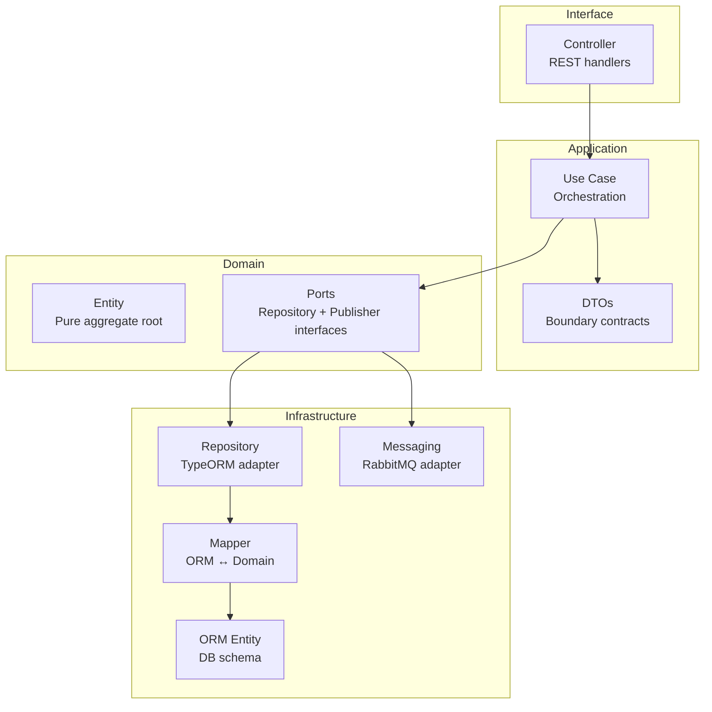
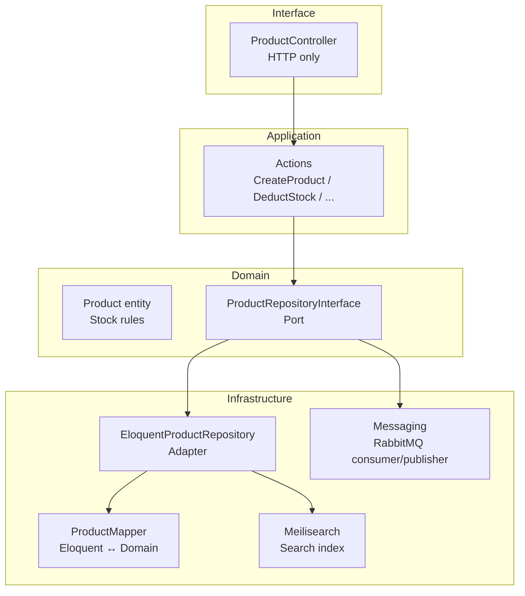
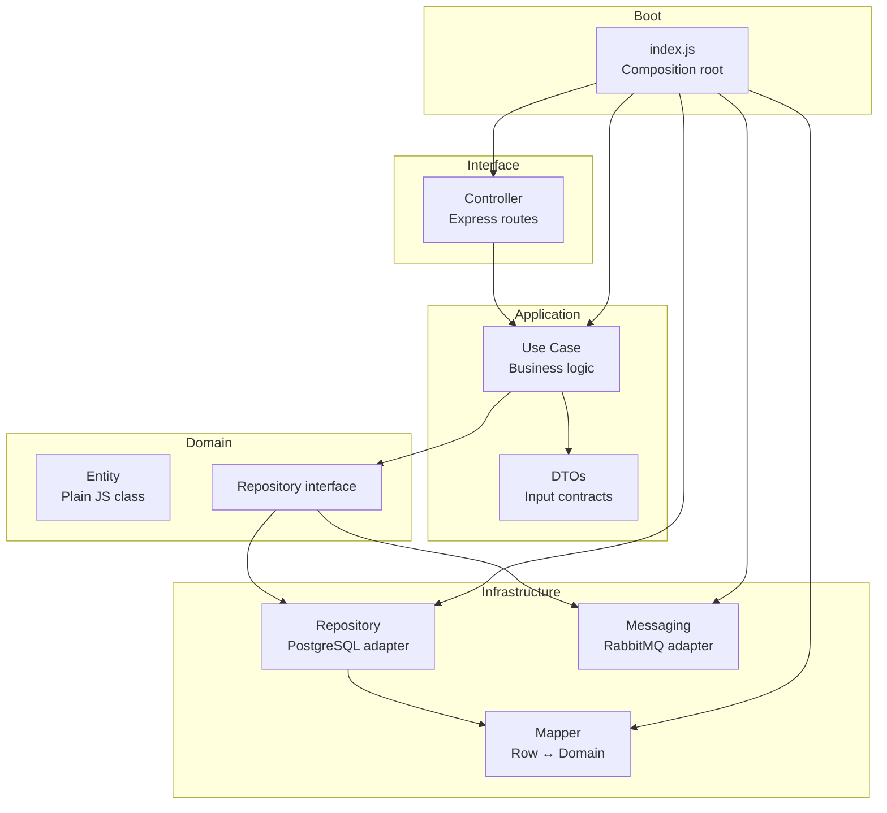
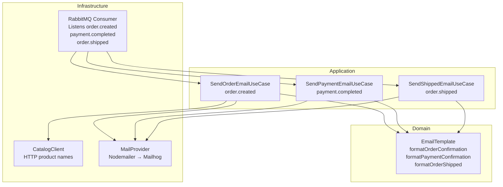
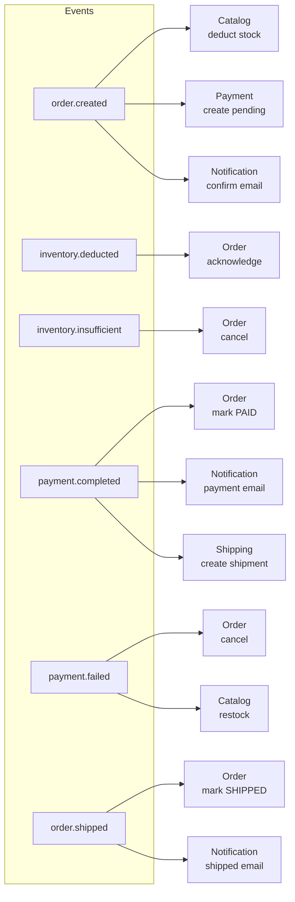
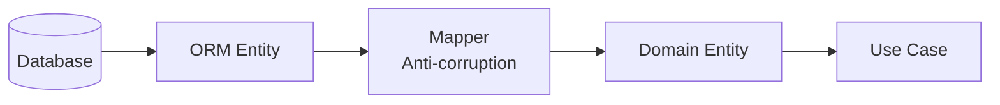

# Developer Deep Dive: E-commerce DDD & Hexagonal Implementation

Granular architectural decisions, file responsibilities, and system design rationale.

---

## Why This Architecture?

### Hexagonal (Ports & Adapters) in NestJS
Used for **Order Service** and **Review Service** — transactional core where maximum decoupling is critical.
- **Domain**: Business rules with zero framework dependencies.
- **Adapters**: Swap PostgreSQL → anything by changing infrastructure layer only.
- **DI-native**: NestJS module/provider system makes ports/adapters path of least resistance.

### Pragmatic DDD in Laravel for Catalog
Laravel's speed comes from Eloquent. Fighting Active Record with strict Hexagonal creates over-engineering.
- **Bounded Contexts** under `app/Core/Catalog` prevent domain leaks.
- **Repository interface** + mapper bridges Eloquent ↔ pure domain models.
- **Use Cases** (`CreateProductAction`, `DeductStockUseCase`) keep controllers thin.

### Node.js Hexagonal (Identity, Payment, Shipping)
- Manual composition root in `index.js`.
- Domain entities (`User`, `Payment`, `Shipment`), repository interfaces, use cases.
- PostgreSQL via `pg` driver, RabbitMQ via `amqplib`.

---

## File-by-File Breakdown

### NestJS: Order Service + Review Service



### Laravel: Catalog Service



### Node.js: Identity, Payment, Shipping



### Notification Service



---

## Cart Service (Express + Redis)

Lightweight service — no build step, no ORM. Cart data stored as Redis hashes:

```
cart:{userId} → hash of {productId → JSON({ name, price, imageUrl, quantity, shopId, shopName })}
```

**Endpoints**: `GET/POST /cart/:userId/items`, `PATCH/DELETE /cart/:userId/items/:productId`, `DELETE /cart/:userId`

On `POST`, if the item exists the quantity is incremented and `shopId`/`shopName` are backfilled (fixes stale entries added before shop support).

## Frontend Features

### Checkout flow (two-step)
1. `/cart` — grouped by shop, checkbox per item → only selected items go to checkout
2. `/checkout` — shipping address form, coupon code → creates order
3. `/checkout/:id` — pay → `/order-success/:id`

Partial checkout (only checked items) deletes only those items from cart; unchecked items persist.

### Cart — Multi-Vendor Grouping
`pages/cart.vue` — items are grouped by `shopId` with a per-shop header showing the shop name. Each item has a checkbox; each shop group has a select-all toggle. The order summary shows selected count and total. "Place Order" only proceeds with checked items.

### Wishlist
`stores/wishlist.ts` — Pinia store, localStorage-backed (no backend). Heart button on product cards, `/wishlist` page, badge in nav.

### Admin dashboard
`pages/admin/index.vue` — stripped to pending shops list with Approve button only. No stats, orders, users, or coupons (those are vendor-owned).

### Vendor Dashboard
`/vendor/dashboard` — stock level bar chart (pure CSS, color-coded green/amber/red), low stock alert banner, action buttons for Products/Orders/Coupons.
`/vendor/products` — CRUD products, update stock (auth-guarded: only shop owner can update).
`/vendor/orders` — incoming orders containing vendor's products, "Mark Shipped" button.
`/vendor/coupons` — create and list shop-scoped coupon codes.

---

## Messaging Strategy

### Choreography Saga (no orchestrator)
Each service reacts to events via RabbitMQ topic exchange `events`:



### Durable queues per service
All queues are named and durable. Events survive consumer restarts. Exclusive queues avoided.

---

## Database Choices

| Service | DB | Rationale |
|---------|----|-----------|
| Order | PostgreSQL | JSONB for items, strict ACID |
| Catalog | MySQL | High-read workload, reliable |
| Identity | PostgreSQL | Shared infra with Order |
| Payment | PostgreSQL | Transactional integrity |
| Review | PostgreSQL | JSONB not needed, consistency |
| Shipping | PostgreSQL | Transactional |
| Cart | Redis | Ephemeral, fast read/write |

Shared-nothing: services only communicate via RabbitMQ. No cross-service DB access.

## Seed Data

Identity service auto-seeds on boot:
- **Admin**: `admin@example.com` / `admin`
- **3 vendors** with fixed UUIDs: `vendor1@example.com`, `vendor2@example.com`, `vendor3@example.com` / `password`

Catalog service seeds via `php artisan db:seed`:
- **3 shops** (Shop One/Two/Three) with matching `owner_id` UUIDs, status `active`
- **140 products** split across shops (hash-based assignment, ~40 per shop)

Fixed UUIDs are coordinated between services:
- Vendors: `a1b2c3d4-...`, `b2c3d4e5-...`, `c3d4e5f6-...`
- Shops: `d1e2f3a4-...`, `e2f3a4b5-...`, `f3a4b5c6-...`

---

## Key Patterns

### Repository + Mapper
Domain never sees ORM/DB objects. Mapper converts at boundary:



### Use Cases as single-responsibility entry points
Each use case takes a DTO, orchestrates domain logic, calls repositories/publishers, returns DTO.

### JWT Auth
Identity service issues JWT (payload: `{ id, email, role }`). Review service uses `JwtAuthGuard` to verify on `DELETE /reviews/:id`. Admin can delete any review; users can delete only their own.

### Manual composition root (Node.js services)
`index.js` instantiates all dependencies explicitly. No DI framework. Makes wiring visible and testable.
