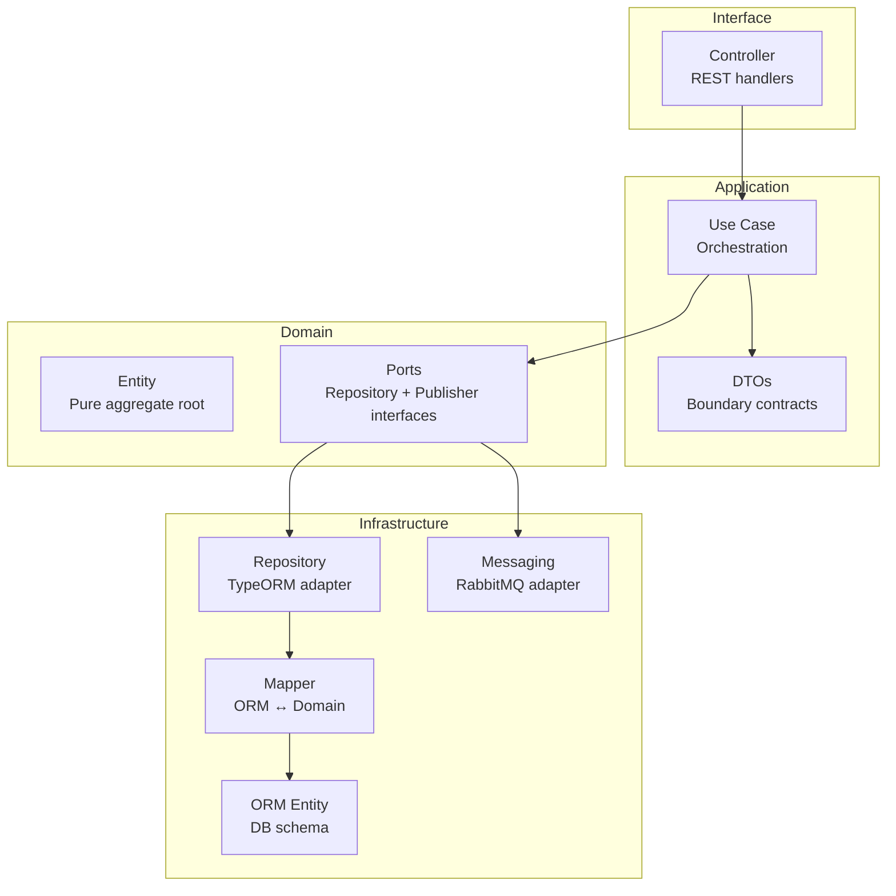
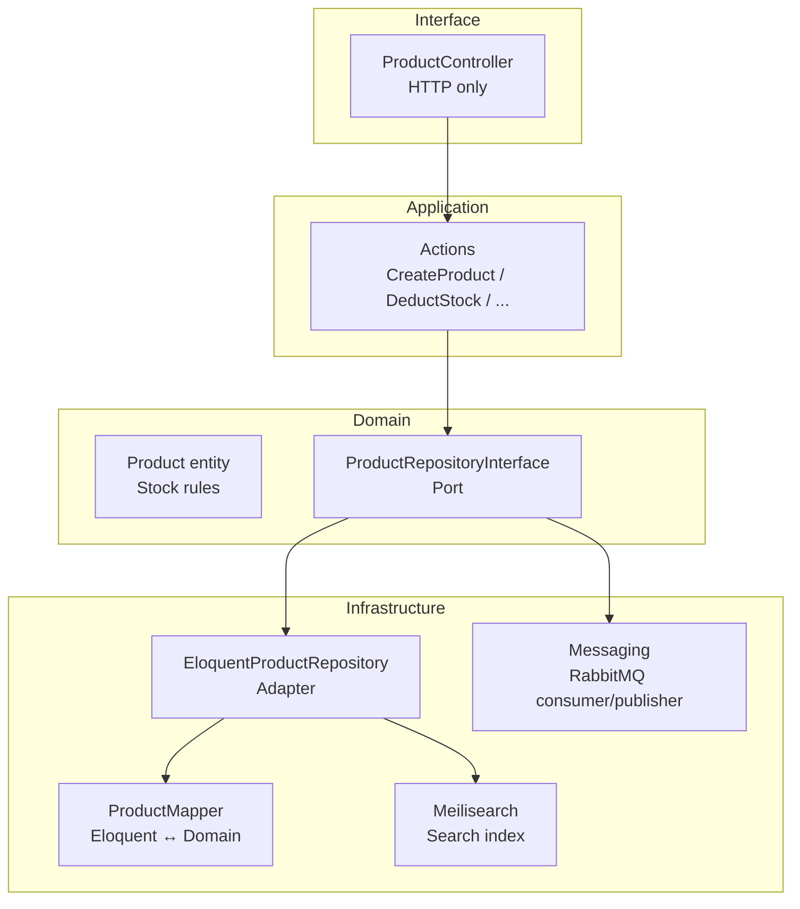
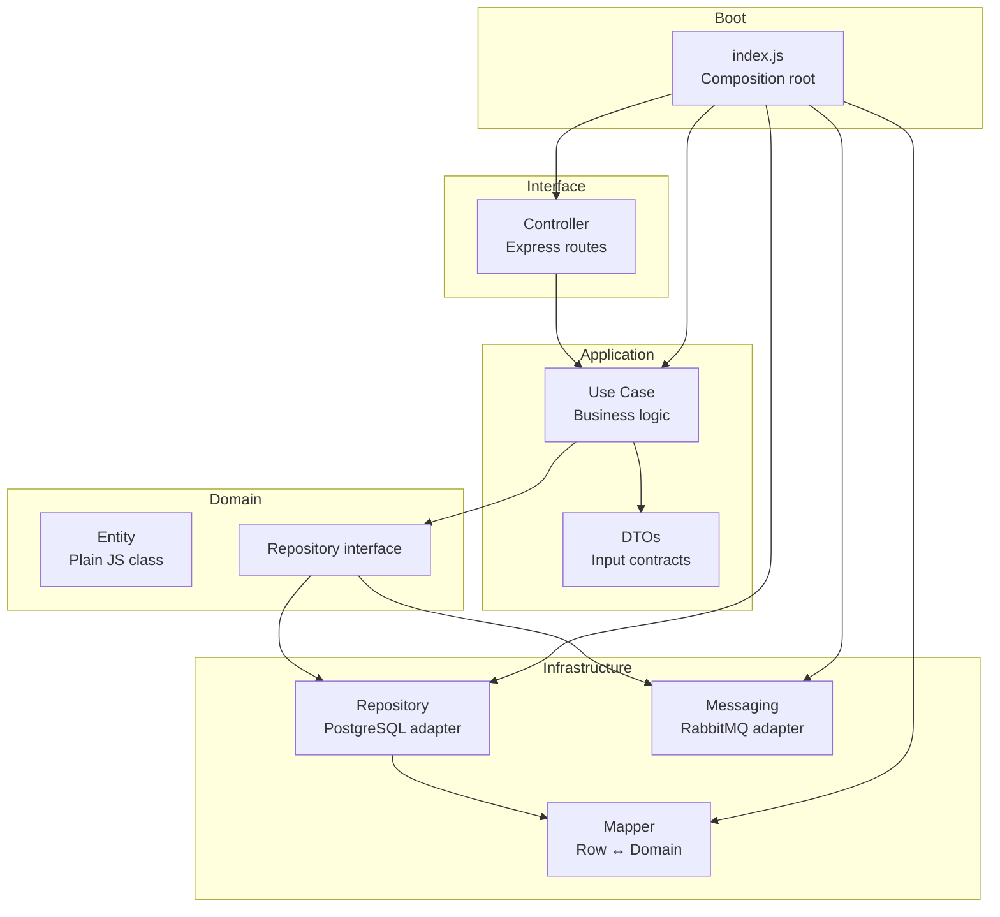
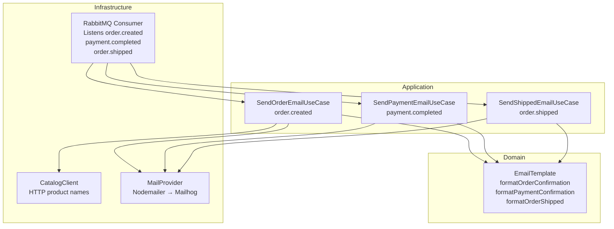
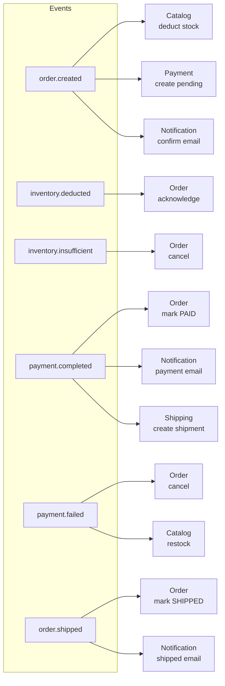
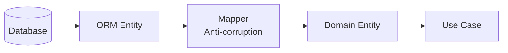

# Developer Deep Dive: E-commerce DDD & Hexagonal Implementation

Granular architectural decisions, file responsibilities, and system design rationale.

---

## Why This Architecture?

### Hexagonal (Ports & Adapters) in NestJS
Used for **Order Service** and **Review Service** — transactional core where maximum decoupling is critical.
- **Domain**: Business rules with zero framework dependencies.
- **Adapters**: Swap PostgreSQL → anything by changing infrastructure layer only.
- **DI-native**: NestJS module/provider system makes ports/adapters path of least resistance.

### Pragmatic DDD in Laravel for Catalog
Laravel's speed comes from Eloquent. Fighting Active Record with strict Hexagonal creates over-engineering.
- **Bounded Contexts** under `app/Core/Catalog` prevent domain leaks.
- **Repository interface** + mapper bridges Eloquent ↔ pure domain models.
- **Use Cases** (`CreateProductAction`, `DeductStockUseCase`) keep controllers thin.

### Node.js Hexagonal (Identity, Payment, Shipping)
- Manual composition root in `index.js`.
- Domain entities (`User`, `Payment`, `Shipment`), repository interfaces, use cases.
- PostgreSQL via `pg` driver, RabbitMQ via `amqplib`.

---

## File-by-File Breakdown

### NestJS: Order Service + Review Service



### Laravel: Catalog Service



### Node.js: Identity, Payment, Shipping



### Notification Service



---

## Cart Service (Express + Redis)

Lightweight service — no build step, no ORM. Cart data stored as Redis hashes:

```
cart:{userId} → hash of {productId → JSON({ name, price, imageUrl, quantity, shopId, shopName })}
```

**Endpoints**: `GET/POST /cart/:userId/items`, `PATCH/DELETE /cart/:userId/items/:productId`, `DELETE /cart/:userId`

On `POST`, if the item exists the quantity is incremented and `shopId`/`shopName` are backfilled (fixes stale entries added before shop support).

## Frontend Features

### Checkout flow (two-step)
1. `/cart` — grouped by shop, checkbox per item → only selected items go to checkout
2. `/checkout` — shipping address form, coupon code → creates order
3. `/checkout/:id` — pay → `/order-success/:id`

Partial checkout (only checked items) deletes only those items from cart; unchecked items persist.

### Cart — Multi-Vendor Grouping
`pages/cart.vue` — items are grouped by `shopId` with a per-shop header showing the shop name. Each item has a checkbox; each shop group has a select-all toggle. The order summary shows selected count and total. "Place Order" only proceeds with checked items.

### Wishlist
`stores/wishlist.ts` — Pinia store, localStorage-backed (no backend). Heart button on product cards, `/wishlist` page, badge in nav.

### Admin dashboard
`pages/admin/index.vue` — stripped to pending shops list with Approve button only. No stats, orders, users, or coupons (those are vendor-owned).

### Vendor Dashboard
`/vendor/dashboard` — stock level bar chart (pure CSS, color-coded green/amber/red), low stock alert banner, action buttons for Products/Orders/Coupons.
`/vendor/products` — CRUD products, update stock (auth-guarded: only shop owner can update).
`/vendor/orders` — incoming orders containing vendor's products, "Mark Shipped" button.
`/vendor/coupons` — create and list shop-scoped coupon codes.

---

## Messaging Strategy

### Choreography Saga (no orchestrator)
Each service reacts to events via RabbitMQ topic exchange `events`:



### Durable queues per service
All queues are named and durable. Events survive consumer restarts. Exclusive queues avoided.

---

## Database Choices

| Service | DB | Rationale |
|---------|----|-----------|
| Order | PostgreSQL | JSONB for items, strict ACID |
| Catalog | MySQL | High-read workload, reliable |
| Identity | PostgreSQL | Shared infra with Order |
| Payment | PostgreSQL | Transactional integrity |
| Review | PostgreSQL | JSONB not needed, consistency |
| Shipping | PostgreSQL | Transactional |
| Cart | Redis | Ephemeral, fast read/write |

Shared-nothing: services only communicate via RabbitMQ. No cross-service DB access.

## Seed Data

Identity service auto-seeds on boot:
- **Admin**: `admin@example.com` / `admin`
- **3 vendors** with fixed UUIDs: `vendor1@example.com`, `vendor2@example.com`, `vendor3@example.com` / `password`

Catalog service seeds via `php artisan db:seed`:
- **3 shops** (Shop One/Two/Three) with matching `owner_id` UUIDs, status `active`
- **140 products** split across shops (hash-based assignment, ~40 per shop)

Fixed UUIDs are coordinated between services:
- Vendors: `a1b2c3d4-...`, `b2c3d4e5-...`, `c3d4e5f6-...`
- Shops: `d1e2f3a4-...`, `e2f3a4b5-...`, `f3a4b5c6-...`

---

## Key Patterns

### Repository + Mapper
Domain never sees ORM/DB objects. Mapper converts at boundary:



### Use Cases as single-responsibility entry points
Each use case takes a DTO, orchestrates domain logic, calls repositories/publishers, returns DTO.

### JWT Auth
Identity service issues JWT (payload: `{ id, email, role }`). Review service uses `JwtAuthGuard` to verify on `DELETE /reviews/:id`. Admin can delete any review; users can delete only their own.

### Manual composition root (Node.js services)
`index.js` instantiates all dependencies explicitly. No DI framework. Makes wiring visible and testable.

---

## Phase 9 — Search & Discovery

### Search Architecture

```
Frontend (search bar / search page)
  → API Gateway :8080 (public, no auth)
    → Catalog Service :8000
      → Meilisearch :7700 (primary)
      → MySQL (fallback: SQL LIKE)
```

The search stack uses **Meilisearch** as the primary full-text engine with a **transparent SQL fallback**. The `EloquentProductRepository` tries Meilisearch first; if it throws or is unavailable, it falls back to a `WHERE name LIKE '%q%' OR description LIKE '%q%'` query.

### Meilisearch Index Schema (`products`)

| Field | Type | Usage |
|-------|------|-------|
| `id` | string | Document ID (product UUID) |
| `name` | string | Searchable, sortable, highlightable |
| `description` | string | Searchable, highlightable |
| `category` | string | Searchable, filterable |
| `sku` | string | Searchable |
| `price` | float | Filterable (range), sortable |
| `imageUrl` | string | Retrieved for display |
| `images` | array | Retrieved |
| `shop_id` | string | Filterable |
| `shop_name` | string | Retrieved for display |
| `in_stock` | boolean | Filterable (stock > 0) |
| `stock` | integer | Retrieved |
| `created_at` | timestamp | Sortable |

Filterable: `category`, `price`, `in_stock`, `shop_id`
Sortable: `price`, `name`, `created_at`

### Discovery Endpoints

Each discovery method has a specific SQL-based fallback:

| Endpoint | Primary | Fallback |
|----------|---------|----------|
| `search()` | Meilisearch `search()` with filters + sort | SQL WHERE LIKE on name/description/sku |
| `trending()` | `product_views` grouped by product_id, last 7 days | `newArrivals()` (latest products) |
| `newArrivals()` | SQL `ORDER BY created_at DESC` | None (native SQL) |
| `recommended()` | SQL same category + price ±50%, excludes current | `newArrivals()` if product has no category |
| `recentlyViewed()` | `product_views` grouped by user_id, latest first | Empty array if no user_id or no views |
| `recordView()` | `INSERT INTO product_views` + cleanup >30d | — |

### product_views Table

```sql
CREATE TABLE product_views (
  id BIGINT AUTO_INCREMENT PRIMARY KEY,
  user_id VARCHAR(255) NOT NULL,
  product_id CHAR(36) NOT NULL,
  viewed_at TIMESTAMP NOT NULL,
  INDEX (user_id, viewed_at),
  INDEX (product_id, viewed_at),
  FOREIGN KEY (product_id) REFERENCES products(id) ON DELETE CASCADE
);
```

- Uses raw `DB::insert()` (no Eloquent model — just a lightweight tracking table)
- Records cleaned up after 30 days on each `recordView()` call
- `recentlyViewed()` uses `GROUP BY product_id + MAX(viewed_at)` instead of `DISTINCT + ORDER BY` to comply with MySQL `ONLY_FULL_GROUP_BY`

### Frontend Discovery

- **Nav search bar** (`layouts/default.vue`): debounced input (250ms), 2-char minimum, calls `/api/products/autocomplete`, shows inline dropdown with up to 6 results (image, name, price, shop, OOS badge)
- **Search page** (`pages/search.vue`): calls `/api/products/search` with filters, renders grid with OOS overlay, facet sidebar (desktop) or drawer (mobile), pagination
- **Homepage sections** (`pages/index.vue`): three horizontal-scroll rows above the catalog grid — Trending, New Arrivals (with "New" badge), Recently Viewed (conditional on auth)

### Known SDK Quirks

- `meilisearch/meilisearch-php` v1.16: `SearchResult::getTotal()` does not exist — use `getTotalHits()` or `getEstimatedTotalHits()`
- `getHits()` returns the array of hit documents
- `getPage()` and `getHitsPerPage()` available for paginated results

---

## Frontend Architecture

### Layouts

| Layout | File | When Used |
|--------|------|-----------|
| **Default** | `layouts/default.vue` | All public pages (home, search, product, cart, etc.) |
| **Vendor** | `layouts/vendor.vue` | All `/vendor/*` pages |

**Default layout** components:
- Sticky header with: brand logo, search bar with autocomplete, nav links (Home, My Orders, Wishlist, Messages, Cart), user dropdown (Profile, My Shop/Become Vendor, Admin Dashboard, Logout)
- Badge counts on Wishlist, Messages (unread), Cart
- Search autocomplete: debounced 250ms, min 2 chars, calls `/api/products/autocomplete`, shows up to 6 results with image/name/price/shop/OOS badge
- NotificationToast (global toast slot)
- Footer

**Vendor layout** components:
- White sidebar (w-64): shop name header, nav links (Dashboard, Products), "Back to Store" link
- NotificationToast
- `definePageMeta({ layout: 'vendor' })` set on all vendor pages

### Component Tree

```
layouts/default.vue
  └─ NotificationToast (global toast)
  └─ <slot /> (page content)
    └─ ProductCard (used in catalog grids)
      └─ Wishlist heart toggle
      └─ Category badge
      └─ Stock indicator
      └─ Add to cart button
```

### Pinia Stores

| Store | File | Persistence | Key State |
|-------|------|-------------|-----------|
| **auth** | `stores/auth.ts` | localStorage (`auth_token`, `auth_user`) | `user`, `token`. Getters: `isLoggedIn`, `isAdmin`, `isVendor`. Actions: `login()`, `register()`, `logout()`, `init()` |
| **cart** | `stores/cart.ts` | Session + API | `items[]`, `guestId`. Actions: `fetchCart()`, `addToCart(product, variant?, quantity)`, `updateQuantity()`, `removeFromCart()`, `checkout()` |
| **notifications** | `stores/notifications.ts` | In-memory | Queue of toasts with auto-dismiss (5s). Actions: `success(msg)`, `error(msg)`, `info(msg)` |
| **wishlist** | `stores/wishlist.ts` | localStorage (`wishlist_items`) | Product ID array, max 12. Actions: `toggle(id)`, `has(id)`, `remove(id)`, `hydrate()` |
| **recentlyViewed** | `stores/recentlyViewed.ts` | localStorage (`recently_viewed`) | Product ID array, max 12. Actions: `track(id)` |

### Auth Flow

1. User submits login form → `auth.login(email, password)` → `POST /login`
2. Service returns `{ token, user }` → stored in Pinia + `localStorage`
3. Gateway forwards JWT as `Authorization: Bearer <token>` header
4. On app mount: `auth.init()` reads localStorage → restores session
5. Middleware `auth.ts`:
   - `/admin` routes: redirects to `/login` if not authenticated, checks `isAdmin`
   - `/vendor` routes: redirects to `/login` if not authenticated
6. Logout: clears Pinia state + localStorage

### Cart Flow (Guest vs Logged-in)

- **Guest**: `guestId` generated on first cart action (random UUID), stored in session
- **Logged-in**: uses `auth.user.id` as cart key
- Cart items stored in Redis as `cart:{userId}` hash
- Each item key: `productId` or `productId:variantId`
- Value: JSON `{ productId, name, price, imageUrl, variantId, quantity, shopId, shopName }`
- Cart page groups items by `shopId`, checkbox-select per shop
- Checkout sends only checked items

### Vendor Product Management Flow

**Create product** (`/vendor/products/create`):
1. Sections: Basic Info (name, sku, category), Pricing & Stock, Description (textarea), Images
2. Image upload: file input → native `fetch()` to `POST /api/upload` (FormData) → returns `{url, filename}`
3. Images display as thumbnails with remove button; first image is `image_url`
4. On submit: `POST /api/products` with `{ name, sku, price, stock, category, description, shop_id, images, image_url }`
5. Redirects to `/vendor/products` on success
6. Nuxt `$fetch` mishandles multipart — must use native `fetch()` with auth header

**Edit product** (`/vendor/products/[id]`):
1. Loads product data, pre-fills form
2. Image carousel: existing images as thumbnails, click to preview, hover overlay to delete
3. Upload additional images (same native fetch pattern)
4. Variant CRUD table below the form

**Variant CRUD:**
- Table columns: SKU, Attributes (JSON), Price, Stock, Image, Actions
- Add: inline form row with inputs → `POST /api/products/:id/variants`
- Edit: click row → inline inputs appear → `PATCH /api/products/:id/variants/:variantId`
- Delete: confirm dialog → `DELETE /api/products/:id/variants/:variantId`
- Stock dot indicators: green (in stock), red (out of stock)

**Product list** (`/vendor/products`):
- Search (debounced input), category select, sort/order controls
- Grid: image, name, category badge, stock count, price, created date
- Stock badges: green (≥10), amber (1-9), red (0)
- Hover-reveal action buttons
- Load-more pagination (no page numbers)
- "Create Product" button + link to edit on each row

### Checkout Flow

1. Cart page → selects items → clicks Checkout → `/checkout`
2. Shipping form: name, address, city, state, zip, country
3. Coupon input: `POST /coupons/validate` → shows discount
4. Order summary: items per shop, subtotal per shop, coupon savings, total
5. Submit: `cart.checkout()` → `POST /orders` → clears cart → redirects to `/order-success/:id`
6. Order service creates order + sub-orders per shop → publishes `order.created`
7. Saga continues: catalog deducts stock → payment creates record → user pays → shipping ships

### Image Upload Detail

```
User selects file(s) → file input change event
  → FormData.append('file', file)
  → native fetch('POST /api/upload', { headers: { Authorization }, body: formData })
  → Laravel UploadController stores in S3 (RustFS), returns { url, filename }
  → URL stored in product.images array or image_url
```

- `image_url` is the primary (first) image
- `images` is a JSON array of all image URLs
- `POST /api/upload` requires `jwt.auth` middleware — auth header must be forwarded
- RustFS endpoint: `http://rustfs:9000` (internal), `http://localhost:9005` (external via gateway)
- Images accessible through gateway: `http://localhost:8080/storage/ecom-files/{filename}`

### Chat/Messaging System

- Buyer → Shop messaging, not buyer-to-buyer
- **Create conversation**: buyer sends first message via `POST /chat/:shopId` with `{ message, productId?, productName?, shopName? }`
- **List conversations (buyer)**: `GET /chat/conversations` → grouped by shop
- **List conversations (vendor)**: `GET /chat/conversations` → grouped by buyer
- **Get messages**: `GET /chat/:shopId` → all messages between buyer and shop
- **Unread count**: `GET /chat/unread-count` → badge number in nav
- Data stored in `chat_messages` table: `id, shop_id, shop_name, buyer_id, message, product_id, product_name, is_read, created_at`
- Product detail page has "Chat with Seller" button → opens `/messages?shop=X&product=Y`

### Coupon System

- Coupons are scoped to a shop (`shopId` field)
- Types: `PERCENTAGE` (e.g. 10% off) or `FIXED` (e.g. $5 off)
- `minOrderAmount`: minimum subtotal to apply
- `maxUses`: global limit
- `POST /coupons/validate` checks: code exists, not expired, not over max uses, meets min amount, correct shop
- Frontend shows applied discount in order summary

### Admin Page

`/admin/index` — only for `role=admin`:
- Sections: Shop Approvals (pending shops table with approve/reject), Return Requests (all returns), Orders Overview (all orders)
- Admin dashboard nav link only visible to admins
- Auth middleware guards the route

### API Gateway Details

**File:** `api-gateway/src/gateway.js`

**Auth middleware:**
- Checks `Authorization: Bearer <token>` header
- Verifies JWT with `jsonwebtoken` using `JWT_SECRET` env var
- Attaches decoded payload to `req.user`
- Returns 401 if missing or invalid

**Public paths:** defined as `[method, prefix]` tuples. Request is public if method matches AND path starts with prefix. Exception: any path starting with `/shops/admin` is always protected.

**Destination resolution:**
- Path prefix `/api/products` → `http://catalog-service:9000` (full path appended)
- Path prefix `/shops` → `http://catalog-service:9000/api` (strips `/shops` prefix, prepends `/api`)
- All other paths → mapped directly to upstream service host

**CORS:** wildcard origin, all methods, all headers. Preflight (OPTIONS) returns 204.

### JWT Token Sharing

The API Gateway verifies JWT signatures. Downstream services (Laravel) do NOT re-verify:
- Gateway forwards `Authorization` header to upstream
- Laravel's `JwtAuth` middleware base64-decodes the JWT payload (without verification)
- Extracts `{ id, email, role }` into `$request->input('jwt_user')`
- This works because the gateway already verified authenticity; internal network is trusted

### Seed Data

**Users** (auto-seeded by user-service `initDb()`):
| UUID | Email | Password | Role |
|------|-------|----------|------|
| `a1b2c3d4-e5f6-7890-abcd-ef1234567890` | admin@example.com | admin | admin |
| `b2c3d4e5-f6a7-8901-bcde-f12345678901` | vendor1@example.com | password | vendor |
| `c3d4e5f6-a7b8-9012-cdef-123456789012` | vendor2@example.com | password | vendor |
| `d4e5f6a7-b8c9-0123-defa-234567890123` | vendor3@example.com | password | vendor |

**Shops** (seeded by `ShopSeeder`):
| UUID | Name | Slug | Owner ID | Status |
|------|------|------|----------|--------|
| `d1e2f3a4-b5c6-4789-a1b2-c3d4e5f6a7b8` | Shop One | shop-one | vendor1 UUID | active |
| `e2f3a4b5-c6d7-4890-b2c3-d4e5f6a7b8c9` | Shop Two | shop-two | vendor2 UUID | active |
| `f3a4b5c6-d7e8-4901-c3d4-e5f6a7b8c9d0` | Shop Three | shop-three | vendor3 UUID | active |

**Products:** 140 products across 10 categories (Algo, Audios, Books, Certifications, Consulting, Courses, E-Books, Templates, Tools, Video Tutorials, Workshops), distributed across 3 shops.

### Workflow Notes

**Hot-reload patterns:**
- **PHP (Laravel):** No restart needed — `docker cp` file into container, next request picks up changes
- **Gateway (Express):** Must restart after file copy: `docker cp ... && docker restart ecom-api-gateway`
- **Nuxt:** Rebuild image for major changes, or use `npm run dev` on host for fast iteration
- **Cart (Express/Redis):** `docker cp` + `docker restart ecom-cart-service`
- **Node services (user, payment, shipping):** `docker cp` + restart

**Rebuild container (after PHP file changes that need composer or npm):**
```
docker-compose up -d --build <service-name>
```

**Running artisan commands in container:**
```
docker exec ecom-catalog-service php artisan <command>
```

**Check logs:**
```
docker logs ecom-catalog-service
docker logs ecom-api-gateway
```

**Common issues:**
- `CollisionServiceProvider` error → delete `bootstrap/cache/packages.php` and `services.php` (stale dev cache). Entrypoint.sh now auto-clears these.
- Node 18.18 fails Nuxt build (`styleText` in `node:util` missing) → use Node 22+
- DB connection refused on fresh start → wait for MySQL/PostgreSQL to finish initializing (~15s)
- Meilisearch not returning results → run `php artisan meilisearch:reindex` after seeding
