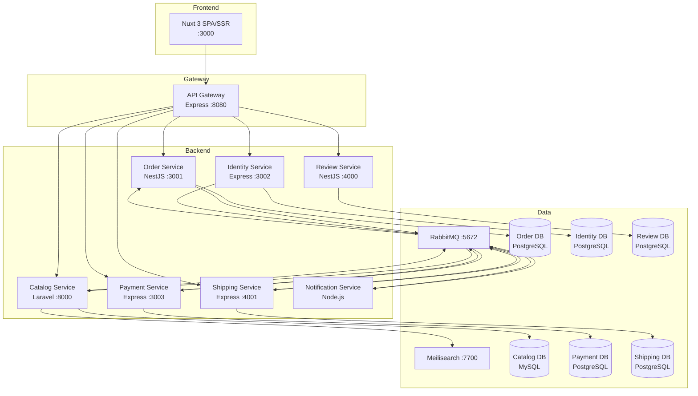
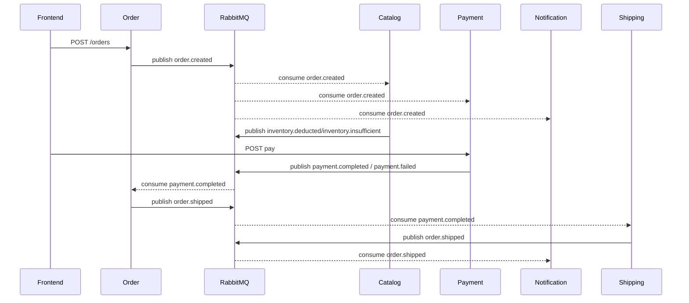
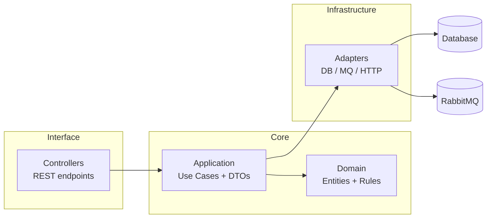

# E-commerce DDD & Hexagonal Architecture

Polyglot microservices — **DDD**, **Hexagonal (Ports & Adapters)**, **Event-Driven** choreography saga.

## Architecture



## Services

| Service | Stack | DB | Port | Pattern |
|---------|-------|----|------|---------|
| **Order** | NestJS | PostgreSQL | 3001 | Strict Hexagonal |
| **Catalog** | Laravel | MySQL | 8000 | Pragmatic DDD |
| **Identity** | Express | PostgreSQL | 3002 | Hexagonal |
| **Payment** | Express | PostgreSQL | 3003 | Hexagonal |
| **Review** | NestJS | PostgreSQL | 4000 | Strict Hexagonal |
| **Shipping** | Express | PostgreSQL | 4001 | Hexagonal |
| **Notification** | Node.js | — | — | Hexagonal |
| **Frontend** | Nuxt 3 | — | 3000 | SPA/SSR |

## Saga Event Flow



## Access Points

| Service | URL |
|---------|-----|
| **Frontend** | http://localhost:3000 |
| **Catalog** | http://localhost:8000/api/products |
| **Order** | http://localhost:3001/orders |
| **Identity** | http://localhost:3002 (POST /register, /login) |
| **Payment** | http://localhost:3003/payments/:orderId |
| **Review** | http://localhost:4000/products/:id/reviews |
| **Shipping** | http://localhost:4001/shipments/:orderId |
| **RabbitMQ UI** | http://localhost:15672 (guest/guest) |
| **Mailhog UI** | http://localhost:8025 |

## Getting Started

```bash
docker compose up --build
```

### Seed Credentials

| Role | Email | Password |
|------|-------|----------|
| **Admin** | `admin@example.com` | `admin` |
| **Vendor 1** (Shop One) | `vendor1@example.com` | `password` |
| **Vendor 2** (Shop Two) | `vendor2@example.com` | `password` |
| **Vendor 3** (Shop Three) | `vendor3@example.com` | `password` |

140 products pre-seeded, split across 3 shops (~40 each).

## Frontend Features

| Feature | Route | Description |
|---------|-------|-------------|
| **Home** | `/` | Product grid with search, staggered animation, "by Shop" links |
| **Shop Page** | `/shops/:id` | Shop profile with product grid |
| **Product** | `/products/:id` | Product detail with shop link, reviews |
| **Cart** | `/cart` | Items grouped by shop, checkbox selection per item/shop |
| **Checkout** | `/checkout` | Shipping form, coupon code, only selected items |
| **Orders** | `/orders` | Order history |
| **Wishlist** | `/wishlist` | localStorage-backed wishlist |
| **Admin Dashboard** | `/admin` | Shop approval only |
| **Vendor Dashboard** | `/vendor/dashboard` | Stock chart, low-stock alerts, product/orders/coupon links |
| **Vendor Products** | `/vendor/products` | Manage products, update stock |
| **Vendor Orders** | `/vendor/orders` | Incoming orders for your shop, mark shipped |
| **Vendor Coupons** | `/vendor/coupons` | Shop-scoped coupon codes |
| **Login/Register** | `/login`, `/register` | JWT auth |

## Email (MailHog)

All notification emails go to MailHog at **http://localhost:8025**.
Two emails per order: order confirmation + payment confirmation.

## Project Structure



## Key Decisions

- **Hexagonal in NestJS**: DI-native, strict port/adapter separation
- **Pragmatic DDD in Laravel**: Bounded contexts under `app/Core/Catalog`, Eloquent speed without domain leaks
- **Node.js Hexagonal**: Manual composition root, domain entities, use cases
- **Choreography saga**: No orchestrator, each service reacts to events
- **Meilisearch**: Full-text search for catalog (lightweight alternative to Elasticsearch)
- **Shared-nothing**: Services communicate only through events
