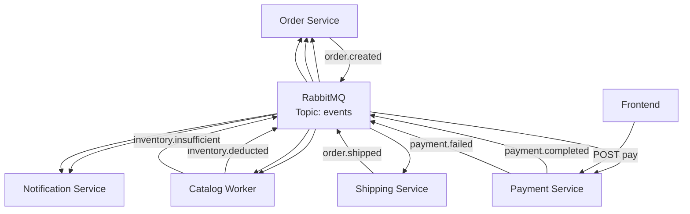

# RabbitMQ Event Schema Definitions

Standard JSON payloads for cross-service communication.

## Event Flow



## 1. Order Service Events

### `order.created`
- **Source**: NestJS (Order Service)
- **Target**: Laravel (Catalog Service), Notification Service
- **Routing Key**: `order.created`
- **Payload**:
```json
{
  "event_id": "uuid",
  "occurred_at": "ISO8601",
  "data": {
    "order_id": "uuid",
    "customer_id": "uuid",
    "items": [
      {
        "product_id": "uuid",
        "quantity": 1,
        "price": 100.00
      }
    ],
    "total": 100.00
  }
}
```

## 2. Catalog Service Events

### `inventory.deducted`
- **Source**: Laravel (Catalog Service)
- **Target**: Order Service (to update order status to 'SHIPPED')
- **Routing Key**: `inventory.deducted`
- **Payload**:
```json
{
  "event_id": "uuid",
  "occurred_at": "ISO8601",
  "data": {
    "order_id": "uuid",
    "product_id": "uuid",
    "quantity_deducted": 1,
    "remaining_stock": 49
  }
}
```

### `inventory.insufficient`
...
```

## 3. Payment Service Events

### `payment.completed`
- **Source**: Payment Service
- **Target**: Order Service (to update status to 'PAID')
- **Routing Key**: `payment.completed`
- **Payload**:
```json
{
  "event_id": "uuid",
  "occurred_at": "ISO8601",
  "data": {
    "order_id": "uuid",
    "transaction_id": "uuid",
    "amount": 100.00,
    "status": "SUCCESS"
  }
}
```

## 4. Shipping Service Events

### `order.shipped`
- **Source**: Shipping Service
- **Target**: Order Service, Notification Service
- **Routing Key**: `order.shipped`
- **Payload**:
```json
{
  "event_id": "uuid",
  "occurred_at": "ISO8601",
  "data": {
    "order_id": "uuid",
    "tracking_number": "TRK123456789",
    "carrier": "FedEx"
  }
}
```
